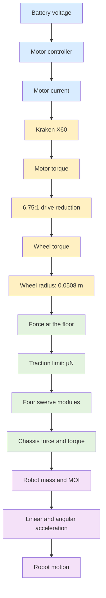
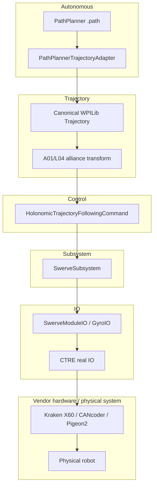
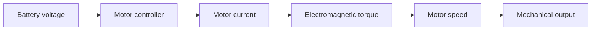
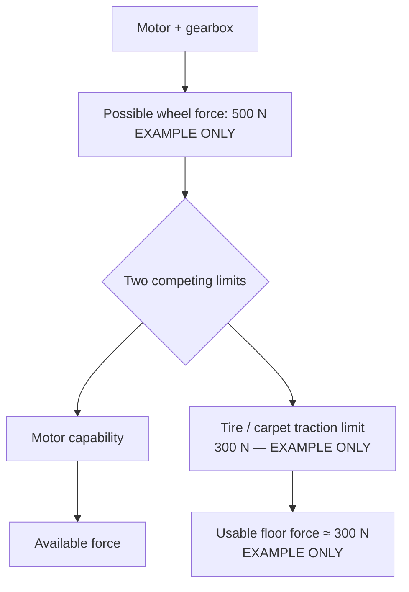
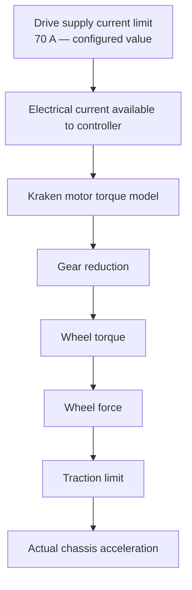
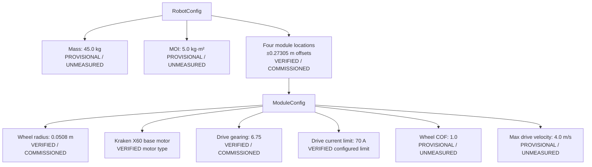
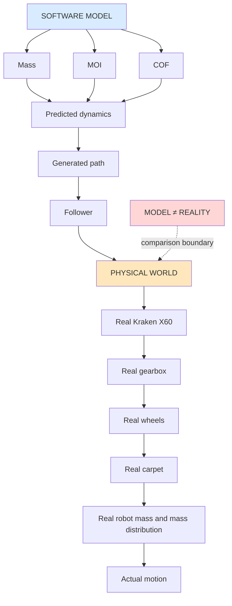
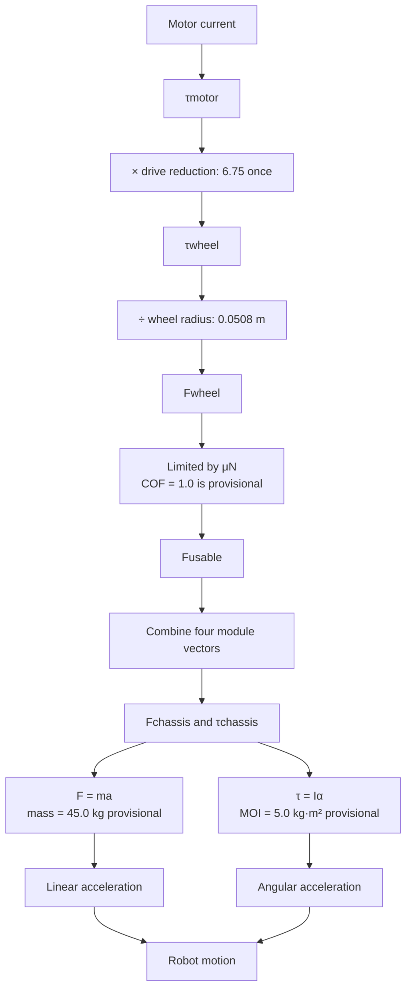

# A01_L06 — Swerve / PathPlanner Physical Model Learning Guide

## Document role

This is a student learning guide for the current A01_L06 implementation. It explains how
electrical energy, motor torque, gearing, wheels, traction, robot dynamics, PathPlanner, and
the frozen L05 follower relate to one another.

It is **not** an architecture authority, a replacement for S00 commissioning documentation, or
a declaration that the learning RobotConfig is physically calibrated.

The guide follows the repository authority order and the frozen control and observation
boundaries. It does not authorize a code, hardware, tuning, or architecture change.

## How to read the labels

- **VERIFIED / COMMISSIONED** means the value is established by current source and the final S00
  commissioning record.
- **PROVISIONAL / UNMEASURED** means the value is intentionally permitted for the learning and
  Simulation exercise, but has not been physically measured or made competition-authoritative.
- **EXAMPLE ONLY** means the number illustrates an equation and is not a measurement of this
  robot.

The four current PathPlanner physical-model values below must retain this exact classification:

> **PROVISIONAL — LEARNING/SIMULATION ONLY — NOT MEASURED — NOT FINAL**
>
> mass = 45.0 kg; MOI = 5.0 kg·m²; maximum drive velocity = 4.0 m/s; wheel COF = 1.0

---

## Part 1 — The big picture

The robot does not jump directly from a `.path` file to a motor. There are physical layers and
software layers between the desired path and the actual motion.

### Complete physical chain



The blue part is mainly electrical, the yellow part is motor and mechanical transmission, the
green part is contact with the floor, and the purple part is whole-robot dynamics. Real hardware
can depart from a software model because friction, voltage sag, temperature, carpet, mass
distribution, and configuration all matter.

### Software reaches the physical chain through architecture boundaries



The adapter produces trajectory data. It does not own localization, alliance policy, command
requirements, drivetrain actuation, or vendor hardware. The follower asks the `SwerveSubsystem`
to accept chassis speeds. Only the IO implementation crosses into CTRE APIs.

---

## Part 2 — Robot mass

Mass is the amount of matter in the robot. Its SI unit is the kilogram, kg.

For straight-line motion, the basic relationship is:

\[
F = ma
\]

where:

- `F` is net force in newtons, N;
- `m` is mass in kilograms, kg;
- `a` is acceleration in meters per second squared, m/s².

Rearranging gives:

\[
a = \frac{F}{m}
\]

### Why PathPlanner needs mass

PathPlanner's `RobotConfig` uses mass when estimating how much force is needed to follow a
trajectory. A lower mass tells the model that a given force produces more acceleration. A higher
mass tells the model that the same force produces less acceleration.

```text
EXAMPLE ONLY: the same 400 N net force

        400 N                         400 N
          →                             →
   ┌─────────────┐               ┌─────────────┐
   │ 25 kg robot │               │ 50 kg robot │
   └─────────────┘               └─────────────┘
       a = 16 m/s²                    a = 8 m/s²

             a = F / m
```

The two accelerations above are arithmetic examples only. They are not measurements of this
robot. The current L06 value `45.0 kg` is **PROVISIONAL / UNMEASURED**.

If the configured mass is too low, the model can expect an acceleration that the real robot
cannot produce. If it is too high, the model can be unnecessarily conservative. The Kraken and
CTRE controller know motor electrical behavior; they do not automatically know the complete robot
mass, battery, bumpers, battery position, or game-piece load.

---

## Part 3 — Moment of inertia

Moment of inertia, or MOI, describes how difficult it is to change rotational motion. Its SI unit
is kg·m².

The rotational equivalent of `F = ma` is:

\[
\tau = I\alpha
\]

where:

- `τ` is chassis torque in N·m;
- `I` is moment of inertia in kg·m²;
- `α` is angular acceleration in rad/s².

Distance from the rotation center matters strongly. Mass near the perimeter contributes more to
MOI than the same mass near the center.

```text
SAME TOTAL MASS — DIFFERENT DISTRIBUTION

Robot A: center-concentrated       Robot B: perimeter-concentrated

       ┌─────────┐                       ●───────●
       │    ●●   │                       │       │
       │    ●●   │                       │       │
       └─────────┘                       ●───────●

       smaller MOI                       larger MOI
```

For the same applied torque, a larger `I` produces less angular acceleration. This matters when a
swerve robot rotates, especially while it translates at the same time. The current L06 MOI,
`5.0 kg·m²`, is **PROVISIONAL / UNMEASURED**. It is not a measured property of the physical
chassis.

### Why combined motion matters

During pure translation, the main question is how the sum of module forces changes `x` and `y`.
During rotation, the same module forces also create torque about the robot center. During a
combined maneuver, both effects happen together, so both mass and MOI influence the model.

---

## Part 4 — Kraken X60 motor model

The Kraken X60 is an electrical-to-mechanical energy converter. Conceptually:



The controller applies voltage and limits current. Current is related to motor torque, but the
relationship is not “amps equal force.” Motor speed, winding resistance, back EMF, voltage sag,
temperature, controller limits, and load all matter.

Important terms:

- **Stall current:** current in a locked-rotor condition in the motor model.
- **Stall torque:** torque in that model at zero speed.
- **Free speed:** the model's approximate speed with little external load.
- **Free current:** current consumed by the spinning motor with little external load.
- **Current limit:** a controller or model constraint that limits available electrical current.

The current L06 code constructs a base `DCMotor.getKrakenX60(1)` model. It does not claim that a
measured torque curve for this particular robot has been obtained.

---

## Part 5 — Drive reduction

The current commissioned drive ratio is:

> **6.75:1 — VERIFIED / COMMISSIONED**

The final S00 L23 commissioning guide records that the earlier `7.85:1` / `7.846153...` values
were superseded by repeated physical measurements using approximately 20 motor-rotations per
wheel-rotation tests. Older S00 lesson records remain historical traceability; they are not the
current gearing authority.

### Mechanical intuition

```text
Motor shaft:       6.75 rotations
                         │
                    ┌────▼────┐
                    │ 6.75:1  │
                    │ gearbox │
                    └────┬────┘
                         │
Wheel shaft:        1 rotation
```

Ignoring losses, reduction trades speed for torque:

```text
Motor side                         Wheel side
HIGHER speed       ───────────▶    LOWER speed
LOWER torque       ───────────▶    HIGHER torque
```

Real gearboxes have losses, so the increase in useful wheel torque is not perfectly ideal.

### L06 PathPlanner reduction ownership

The resolved PathPlannerLib vendordep is `PathPlannerLib-java:2026.1.2`. Its seven-argument
`ModuleConfig` overload is:

```java
ModuleConfig(
    double wheelRadiusMeters,
    double maxDriveVelocityMPS,
    double wheelCOF,
    DCMotor driveMotor,
    double driveGearing,
    double driveCurrentLimit,
    int numMotors)
```

The implementation internally applies `driveMotor.withReduction(driveGearing)` and derives its
torque-loss representation. Therefore L06 intentionally uses:

```java
DCMotor.getKrakenX60(1)
+ driveGearing = Constants.SwerveConstants.kDriveGearRatio // 6.75
```

The motor model is un-reduced at construction time, and `ModuleConfig` applies the one drivetrain
reduction. Do **not** pre-apply `.withReduction(6.75)` and also pass `6.75` as `driveGearing`.

```mermaid
flowchart TD
    A[Kraken X60 base model] --> B[withReduction(6.75) inside ModuleConfig]
    B --> C[One drivetrain reduction representation]
    D[Pre-apply withReduction(6.75)] --> E[Then pass driveGearing = 6.75]
    E --> F[6.75 × 6.75 ≈ 45.56]
    F --> G[WRONG DOUBLE-REDUCTION MODEL]
    style C fill:#d9f2d9
    style G fill:#ffd6d6
```

The `45.56` result is an **EXAMPLE ONLY** of the erroneous effective representation. It is not
the installed gearing. The current software representation applies `6.75` exactly once.

---

## Part 6 — Wheel radius

The current source uses:

- wheel radius = `0.0508 m` — **VERIFIED / COMMISSIONED**;
- wheel diameter = `0.1016 m`, or 4 inches — **VERIFIED / COMMISSIONED**.

The source expresses these as `Units.inchesToMeters(2.0)` and `Units.inchesToMeters(4.0)`.

For rolling motion:

\[
v = \omega r
\]

where `v` is tangential speed in m/s, `ω` is wheel angular speed in rad/s, and `r` is radius in
meters.

For torque to tangential force:

\[
F = \frac{\tau}{r}
\]

```text
                         τwheel
                           ↻
                      ┌─────────┐
                      │  WHEEL  │
                      └────┬────┘
                           │
                           │ r = 0.0508 m
                           ▼
                     CONTACT PATCH ───▶ F = τ / r
```

A smaller radius converts the same torque into more ideal tangential force but requires more wheel
angular speed for the same ground speed. A larger radius does the opposite. A wrong radius causes
both distance/speed conversion and force estimates to be wrong.

---

## Part 7 — Traction and coefficient of friction

The floor can only accept so much tangential force before the wheel slips. A useful introductory
model is:

\[
F_{traction,max} \approx \mu N
\]

where `μ` is the coefficient of friction and `N` is normal force in newtons.



The example teaches the limiting idea only. If the motor/gearbox could produce 500 N but the
wheel-carpet interface permits only 300 N, approximately 300 N reaches the floor before slip.

The current L06 wheel COF value, `1.0`, is **PROVISIONAL / UNMEASURED**. It is not a claim about
the actual carpet, tread compound, loading, or dynamic friction. Normal force is also distributed
among four modules and can change during acceleration, braking, turning, or a collision.

```text
AVAILABLE MOTOR FORCE ≠ GUARANTEED FLOOR FORCE

Motor force capability
          │
          ▼
       traction
          │
          ▼
     usable force
```

A powerful Kraken does not guarantee that all commanded torque becomes chassis acceleration.

---

## Part 8 — Current limit

The current commissioned drive supply limit is:

> **70 A — VERIFIED / COMMISSIONED configuration value**

It is applied in the CTRE drive configuration and supplied to the PathPlanner `ModuleConfig`
model. These are related but distinct concepts:



`70 A` is not 70 newtons, not 70 units of wheel force, and not a direct acceleration command.
Actual acceleration depends on motor speed, voltage, gearing, wheel radius, traction, mass,
controller behavior, and the requested trajectory.

---

## Part 9 — Four modules become chassis motion

Each swerve module can point its wheel force vector in a chosen direction. The four vectors combine
into chassis translation and rotation.

```text
                         FRONT

                    FL ↗       ↖ FR

                       ┌───────┐
                       │ ROBOT │
                       │   ●   │  ● = approximate center
                       └───────┘

                    BL ↗       ↖ BR
```

The current module geometry is square:

- wheelbase = `0.5461 m` — **VERIFIED / COMMISSIONED**;
- trackwidth = `0.5461 m` — **VERIFIED / COMMISSIONED**;
- half-offsets = `±0.27305 m` in the four `RobotConfig` module locations.

### A. Pure translation

```text
             ↑           ↑
             │           │
          ┌───────────────┐
          │     ROBOT     │
          └───────────────┘
             ↑           ↑

             ΣF ≠ 0, useful Στ ≈ 0
             Result: translation
```

### B. Pure rotation

```text
          ↗                 ↘
            ┌─────────────┐
          ↘ │      ●      │ ↗
            └─────────────┘
          ↗                 ↘

             ΣF ≈ 0, but Στ ≠ 0
             Result: rotation about the center
```

### C. Translation plus rotation

```text
          ↗                 ↑
            ┌─────────────┐
          → │      ●      │ →
            └─────────────┘
          ↓                 ↘

             ΣF ≠ 0 and Στ ≠ 0
             Result: translation and rotation together
```

The actual module vectors are produced by the swerve kinematics and accepted by the
`SwerveSubsystem`; this guide does not replace that control implementation.

---

## Part 10 — RobotConfig and ModuleConfig

`RobotConfig` is PathPlanner's model of the whole robot. `ModuleConfig` describes the repeated
drive module model. In current L06, `RobotContainer` constructs them at the composition root and
passes the resulting model to `PathPlannerTrajectoryAdapter`.



### Current classification

| RobotConfig / ModuleConfig concept | Current L06 value | Classification | Meaning |
|---|---:|---|---|
| Drive motor | Kraken X60 | VERIFIED motor type | The model uses `DCMotor.getKrakenX60(1)`. |
| Drive motors per module | 1 | VERIFIED configuration | One drive motor is supplied to `ModuleConfig`. |
| Wheel radius | 0.0508 m | VERIFIED / COMMISSIONED | Source and S00 final record agree. |
| Drive gearing | 6.75:1 | VERIFIED / COMMISSIONED | Established by repeated physical 20-rotation tests. |
| Drive supply current limit | 70 A | VERIFIED configured limit | Current CTRE commissioning setting and model input. |
| Wheelbase / trackwidth | 0.5461 m / 0.5461 m | VERIFIED / COMMISSIONED | Source geometry. |
| Module offsets | ±0.27305 m | DERIVED from verified geometry | Half of wheelbase and trackwidth. |
| Robot mass | 45.0 kg | PROVISIONAL / UNMEASURED | Learning and Simulation only. |
| Robot MOI | 5.0 kg·m² | PROVISIONAL / UNMEASURED | Learning and Simulation only. |
| Wheel COF | 1.0 | PROVISIONAL / UNMEASURED | Learning and Simulation only. |
| Maximum drive velocity in ModuleConfig | 4.0 m/s | PROVISIONAL / UNMEASURED | Learning and Simulation model input; not a measured physical maximum. |

The value `4.0 m/s` also appears in the inherited swerve output configuration as a configured
maximum wheel-speed value. That software limit and the PathPlanner model input are not evidence
that the physical robot has been measured to reach 4.0 m/s.

### What the model does not know automatically

The model does not automatically discover the robot's loaded mass, battery voltage under load,
wheel-carpet friction, center of mass, MOI, tread condition, or whether every real sensor and
conversion is configured correctly. Those facts require measurement or commissioning evidence.

---

## Part 11 — Path constraints versus physical hard limits

The current asset is `A01_L06_OneMeter_Forward.path`:

- canonical Blue-frame start: `(0.000 m, 0.000 m, 0°)`;
- canonical Blue-frame end: `(1.000 m, 0.000 m, 0°)`;
- maximum translation velocity: `0.50 m/s`;
- maximum translation acceleration: `1.0 m/s²`;
- maximum angular velocity: `0.75 rad/s`;
- maximum angular acceleration: `1.50 rad/s²`;
- zero intended holonomic rotation;
- no event markers, rotation targets, constraint zones, or path-pointing zones.

The path constraints control trajectory generation. They do not automatically create an
independent physical acceleration clamp on every possible drivetrain output.

```mermaid
flowchart TD
    A[PathPlanner path constraints] --> B[Trajectory generation]
    B --> C[Desired trajectory states]
    C --> D[Holonomic follower]
    D --> E[Chassis-speed command]
    E --> F[Swerve drivetrain]
    G[Path max acceleration = 1.0 m/s²] -. is not automatically .-> H[Independent runtime |dV/dt| clamp]
```

The current inherited follower does have separate speed bounds:

- translation command magnitude is bounded to `0.50 m/s`;
- angular command is clamped to `±0.75 rad/s`;
- the follower uses a hard timeout equal to generated trajectory duration plus a `3.0 s` margin;
- mode loss, invalid pose/state/time, cancellation, and timeout call centralized
  `SwerveSubsystem.stop()`.

Those are runtime command behaviors. They are different from a proof that the physical drivetrain
can never change speed faster than the path's acceleration constraint. The current path is a
conservative one-meter learning path, but Simulation PASS does not prove physical model accuracy
or real-floor trajectory accuracy.

---

## Part 12 — Software architecture connection

The complete A01_L06 flow is intentionally narrow:

```text
PathPlanner .path
        │
        ▼
PathPlannerTrajectoryAdapter
        │  loads, validates, generates, converts
        ▼
Canonical WPILib Trajectory
        │
        ▼
A01/L04 alliance transform — exactly once
        │
        ▼
HolonomicTrajectoryFollowingCommand
        │  estimates pose, computes bounded chassis speeds
        ▼
SwerveSubsystem
        │  owns drivetrain behavior and stop authority
        ▼
Swerve IO contracts
        │
        ▼
CTRE real IO
        │
        ▼
Kraken X60 / CANcoder / Pigeon2 / physical hardware
```

PathPlanner does not own `SwerveSubsystem`, localization, alliance policy, safety, or command
requirements. `RobotContainer` remains the composition root. The observation flow remains
hardware → IO inputs → subsystem/estimator → immutable observation → telemetry.

This separation matters because an autonomous command should express a robot action through the
subsystem contract. It should not construct a motor controller, read a CANcoder directly, or
bypass the IO boundary.

### One alliance transform

The asset remains in canonical Blue coordinates. L04 owns the transform to the selected field
alliance. PathPlanner flipping is disabled by the adapter, and no second transform is applied.

```text
Canonical Blue path ──[L04 transform once]──▶ execution trajectory

PathPlanner flipping: DISABLED
Second application of L04 transform: FORBIDDEN
```

---

## Part 13 — Model error

Model error means the software's approximation differs from the physical robot. It does not mean
that the software is necessarily broken; it means the prediction may be wrong.



Simulation PASS validates software behavior under the model. It does not automatically validate
the physical model, the real carpet coefficient, the real chassis MOI, or real-floor trajectory
accuracy.

| Model error | Conceptual effect |
|---|---|
| Mass too low | Predicted acceleration can be too optimistic. |
| Mass too high | Predicted acceleration can be too conservative. |
| MOI too low | Predicted rotational response can be too quick. |
| MOI too high | Predicted rotational response can be too slow. |
| COF too high | The model may assume more usable floor force than the carpet provides. |
| COF too low | The model may be unnecessarily conservative. |
| Wheel radius wrong | Speed, distance, and force conversions can all be wrong. |
| Gearing wrong | Motor-to-wheel speed and torque conversion can be wrong. |
| Current assumption wrong | Available modeled torque can disagree with actual electrical limits. |

The current L06 implementation intentionally labels mass, MOI, COF, and the PathPlanner maximum
drive velocity as provisional. Do not silently promote them to measured, calibrated, final, or
competition-authoritative values.

---

## Part 14 — Current A01_L06 status

The repository and supplied verification evidence establish:

- the L06 implementation exists;
- the PathPlannerLib 2026.1.2 compatibility gate passed under Java 17;
- focused L06 tests passed, 18/18;
- inherited L01–L05 regression passed;
- the full test suite and clean build passed;
- Blue Simulation passed for the canonical approximately one-meter motion;
- the alliance-transformed opposite-direction Simulation passed for approximately one meter;
- the PathPlanner RobotConfig contains explicitly provisional/unmeasured mass, MOI, COF, and
  maximum-drive-velocity values;
- L06 is `COMPLETE / FROZEN / READ-ONLY`;
- post-recalibration real-robot L06 one-meter autonomous execution was user-verified on both Blue
  and Red; the Blue run showed slight endpoint overshoot followed by a small closed-loop reverse
  correction and settling near the intended endpoint.

Simulation validates the software path, adapter, transform, follower, and simulation behavior
under the configured model. The post-recalibration Blue and Red runs provide functional physical
validation, but exact endpoint accuracy is not formally measured or claimed. The configured
mass `45.0 kg` is provisional and known to exceed the user's current real-robot mass estimate;
MOI, COF, and maximum drive velocity are also provisional. No single provisional value is proven
to cause the observed behavior, and final physical-model/PID/feedforward tuning is deferred.

---

## Part 15 — Knowledge check

Try to answer before opening the answer key.

1. If `RobotConfig` says 25 kg but the robot is actually 50 kg, which mass does the PathPlanner
   model use?
2. What is the SI unit of mass?
3. If a 400 N net force acts on a 50 kg robot, what is the example acceleration from `a = F/m`?
4. Why can two robots with the same total mass have different MOI?
5. What equation relates chassis torque, MOI, and angular acceleration?
6. What does the current 6.75:1 drive ratio mean for motor rotations and wheel rotations?
7. Why must the 6.75 reduction be represented exactly once in the L06 `ModuleConfig` model?
8. What is the current commissioned wheel radius in meters?
9. If wheel force capability is 500 N but traction permits only 300 N, approximately how much
   force can reach the floor before slip? Label the numbers correctly.
10. Is the current 70 A value itself a force or an acceleration?
11. What is the difference between a trajectory acceleration constraint and an independent runtime
    acceleration limiter?
12. Which layer should know CTRE vendor APIs?
13. Which component owns centralized drivetrain stop authority?
14. Where does the L04 alliance transform happen, and how many times?
15. Does Simulation PASS prove that the provisional mass, MOI, COF, and maximum drive velocity are
    physically measured and accurate?

### Answer key

1. The PathPlanner model uses the configured 25 kg until the configuration is changed.
2. Kilograms, kg.
3. `400 N / 50 kg = 8 m/s²` — an **EXAMPLE ONLY** calculation.
4. Their mass can be distributed differently relative to the rotation center.
5. `τ = Iα`.
6. Approximately 6.75 motor rotations correspond to one wheel rotation.
7. The explicit `ModuleConfig` overload applies `driveMotor.withReduction(6.75)` internally;
   supplying a pre-reduced motor and 6.75 again would model the reduction twice.
8. `0.0508 m`.
9. Approximately 300 N in the **EXAMPLE ONLY** scenario, because traction is the lower limit.
10. No. It is a configured electrical current limit, not force or acceleration.
11. A trajectory constraint shapes generated desired states; an independent runtime limiter would
    enforce an output behavior during execution. They are not automatically the same.
12. The IO implementation layer.
13. `SwerveSubsystem.stop()` remains the centralized authority.
14. A01/L04 applies it once after the canonical Blue trajectory is produced; PathPlanner flipping
    is disabled.
15. No. It validates software behavior under the configured model, not physical calibration.

---

## From Equation to Robot

The complete physical story can be summarized as follows:



The software concepts next to that physical chain are:

| Physical quantity | Current PathPlanner concept |
|---|---|
| Motor type | `DCMotor.getKrakenX60(1)` |
| Motor-to-wheel reduction | `ModuleConfig.driveGearing = 6.75`, applied once internally |
| Wheel radius | `ModuleConfig.wheelRadiusMeters = 0.0508` |
| Motor/module count | `ModuleConfig.numMotors = 1` |
| Electrical current limit | `ModuleConfig.driveCurrentLimit = 70.0` and CTRE drive configuration |
| Friction assumption | `ModuleConfig.wheelCOF = 1.0`, provisional/unmeasured |
| Maximum modeled drive velocity | `ModuleConfig.maxDriveVelocityMPS = 4.0`, provisional/unmeasured |
| Translational inertia input | `RobotConfig.massKG = 45.0`, provisional/unmeasured |
| Rotational inertia input | `RobotConfig.MOI = 5.0`, provisional/unmeasured |
| Module geometry | Four `Translation2d` locations at ±0.27305 m offsets |
| Generated motion | PathPlanner trajectory states converted to WPILib `Trajectory.State` values |
| Execution | L04 transform once, then frozen L05 holonomic follower |

The central lesson is:

> Electrical current becomes motor torque; gearing and wheel radius turn torque into a possible
> floor force; traction limits the force that actually reaches the carpet; four modules combine
> force and torque; mass and MOI determine the resulting motion; PathPlanner approximates that
> chain in `RobotConfig` and `ModuleConfig`; the frozen follower and subsystem safely execute the
> resulting trajectory contract.

That is the connection between the physical robot and the current A01_L06 software model.
