# A01_L06 Trajectory Follower and Swerve Control Learning Guide

## Document role

This is a student learning guide for the current
`A01_L06_PathPlannerPathAndRuntimeIntegration` implementation. It explains why a path must become
a time-indexed trajectory, how the L05 holonomic follower turns a sampled state and
`EstimatedPose` into a chassis request, and how the inherited swerve pipeline turns that request
into four real or simulated module outputs.

This guide is not an API reference, an architecture authority, a tuning authorization, or
real-robot verification evidence. The Frozen Backbone, the A01 ADR, the active lesson records,
and the current source remain authoritative.

### Evidence labels used in this guide

- **VERIFIED**: established by the current A01_L06 source, asset, tests, frozen lesson records, or
  the installed WPILib 2026.2.1 source.
- **PROVISIONAL**: intentionally allowed for learning or Simulation, but not physically measured
  or competition-authoritative.
- **EXAMPLE ONLY**: an invented number used to teach an equation or sign convention. It is not a
  measurement of this robot.

The four current `RobotConfig` learning values retain this exact classification:

> **PROVISIONAL - LEARNING/SIMULATION ONLY - NOT MEASURED - NOT FINAL**
>
> mass = 45.0 kg; MOI = 5.0 kg*m^2; maximum drive velocity = 4.0 m/s; wheel COF = 1.0

## Learning outcomes

After this lesson, a student should be able to explain:

1. why a geometric path is not yet an executable motion plan;
2. how velocity and acceleration constraints shape a trajectory;
3. what `trajectory.sample(t)` means in a periodic robot program;
4. how feedforward and pose feedback combine;
5. why `ChassisSpeeds` are chassis intent, not motor commands;
6. how swerve kinematics, optimization, and desaturation create four module states;
7. why CANcoder calibration affects steering, tracking, and localization; and
8. how the current architecture fails closed without transferring subsystem or IO ownership.

---

## 1. The complete current A01_L06 control flow

Why start with the whole chain? Because each arrow answers a different engineering question. A
correct path asset cannot compensate for a wrong frame transform, a wrong pose estimate, a wrong
module angle, or a bypassed safety boundary.

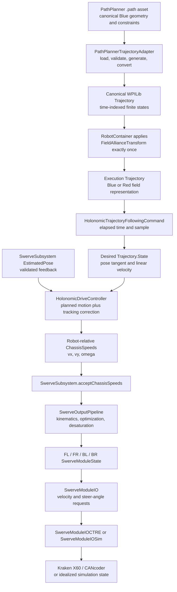

**VERIFIED current implementation names:**

- `PathPlannerTrajectoryAdapter.createCanonicalTrajectory()` loads the one approved asset and
  produces a finite native `Trajectory`.
- `RobotContainer` is the exactly-one transform owner for the execution trajectory and desired
  holonomic heading.
- `HolonomicTrajectoryFollowingCommand` samples the trajectory and uses validated
  `SwerveSubsystem.getEstimatedPose()` feedback.
- `HolonomicDriveController.calculate(...)` produces robot-relative `ChassisSpeeds`.
- `SwerveSubsystem.acceptChassisSpeeds(...)` retains subsystem ownership of drivetrain intent.
- `SwerveOutputPipeline` produces final FL, FR, BL, BR states.
- `SwerveModuleIO` is the vendor-neutral hardware boundary.
- `SwerveModuleIOCTRE` uses Phoenix 6 real hardware; `SwerveModuleIOSim` uses an idealized
  vendor-neutral module simulation.

### A source-order clarification

The conceptual checklist in the task mentioned desaturation before optimization. The current
source order is different and must be taught accurately:

```text
robot-relative ChassisSpeeds
    -> SwerveKinematics
    -> desired FL / FR / BL / BR states
    -> SwerveModuleStateOptimizer for each module
    -> SwerveDriveKinematics.desaturateWheelSpeeds for all four states
    -> final IO requests
```

Optimization may reverse a speed and rotate its angle by 180 degrees; desaturation then multiplies
all signed speeds by one positive common factor. This preserves the optimized directions and
ratios. This guide follows the actual source order. No architecture change is proposed.

---

## 2. Path versus trajectory

### Why the distinction matters

A path answers:

> Where should the robot travel?

A trajectory answers:

> Where should the robot be at time `t`, and how fast should it be moving?

A path is geometry. A trajectory adds time, velocity, acceleration, and state ordering. A follower
needs the second form because it must decide what to request now, not merely which curve exists on
the field.

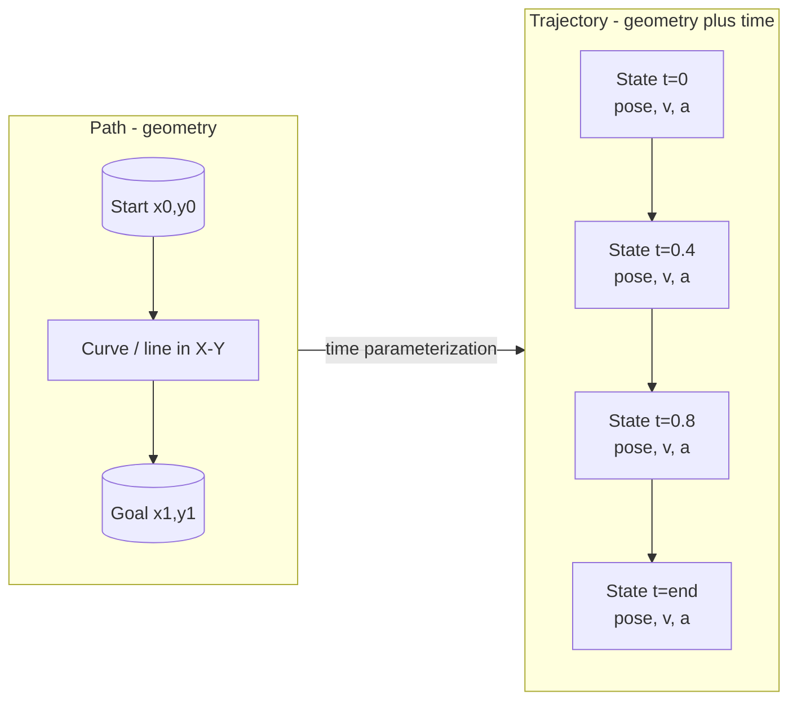

```text
PATH VIEW - no clock

Y
^             curve
|  start o------------------------------o goal
+-------------------------------------------------> X

TRAJECTORY VIEW - the same route with scheduled states

t=0.00       t=0.25       t=0.50       t=0.75       t=end
  o-------------o-------------o-------------o-------------o
pose0          pose1         pose2         pose3          pose4
v0             v1            v2            v3             vend
```

**VERIFIED current A01_L06 boundary:** the `.path` asset contains two anchors and constraints.
`PathPlannerTrajectoryAdapter` asks PathPlanner to generate trajectory states, validates them, and
converts them into the native `Trajectory.State` form consumed by the frozen L05 follower.

Do not confuse two rotations:

- `Trajectory.State.poseMeters.getRotation()` is the path tangent used for translational
  feedforward direction.
- the desired holonomic robot heading is a separate `Rotation2d`; current L06 uses canonical
  `0 deg`, transformed once to `180 deg` for Red.

---

## 3. Velocity constraint: a ceiling, not a command

### Why

`maximum velocity = 0.50 m/s` does not mean every state must move at `0.50 m/s`. It means the
trajectory generator must not plan a state above that ceiling. A robot starting at zero speed
must accelerate, and a robot ending at zero speed must decelerate. A short path may run out of
distance before the ceiling is reachable.

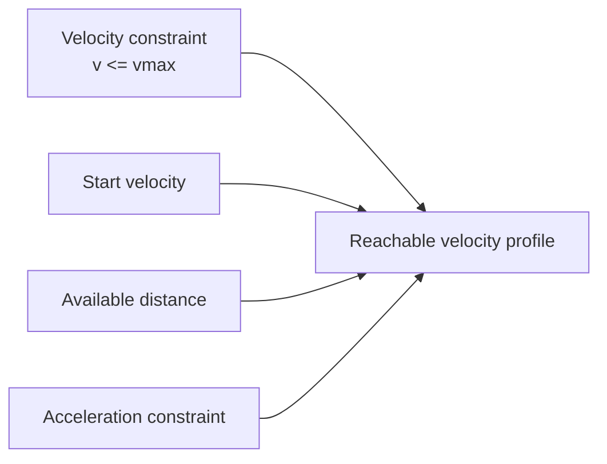

### Worked short-path example

**EXAMPLE ONLY:** start and end at rest, distance `s = 0.10 m`, acceleration magnitude
`a = 1.0 m/s^2`, velocity ceiling `vmax = 0.50 m/s`.

For a symmetric accelerate-then-decelerate move, half of the distance is available for
acceleration. Using

```text
v^2 = v0^2 + 2as
```

on the first `0.05 m`:

```text
vpeak^2 = 0^2 + 2(1.0)(0.05)
vpeak   = sqrt(0.10)
vpeak   approximately 0.316 m/s
```

The short move peaks below `0.50 m/s`. The ceiling is never reached, and that is correct.

---

## 4. Acceleration constraint and velocity-profile shape

### Why acceleration changes reachability

Velocity says how fast the robot is moving. Acceleration says how quickly velocity may change in
the generated plan. The constant-acceleration relationship

```text
v^2 = v0^2 + 2as
```

shows that reaching a higher speed needs either more acceleration or more distance. With a fixed
acceleration ceiling, distance determines whether there is room for a cruise segment.

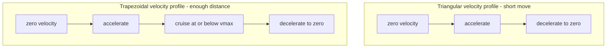

```text
velocity
  ^                 TRIANGULAR
  |                    /\
  |                   /  \
  |__________________/____\________________> time

velocity
  ^                 TRAPEZOIDAL
  |                 /--------\  <- velocity ceiling may be reached
  |                /          \
  |_______________/____________\____________> time
```

A triangular profile has no constant-speed plateau. A trapezoidal profile has enough distance to
accelerate, cruise, and decelerate. Real path parameterization can also account for curvature,
angular constraints, starting/ending states, and the configured robot model, so these simple
shapes are intuition rather than a claim about every generated sample.

**VERIFIED current asset constraints:** `0.50 m/s` maximum translation velocity,
`1.00 m/s^2` maximum translation acceleration, `0.75 rad/s` maximum angular velocity, and
`1.50 rad/s^2` maximum angular acceleration.

---

## 5. Trajectory sampling

### Why sample instead of jumping between waypoints

The robot controller needs a smooth reference for the present elapsed time. Sampling asks the
trajectory for the state that belongs at `t`, interpolating between stored states when necessary.

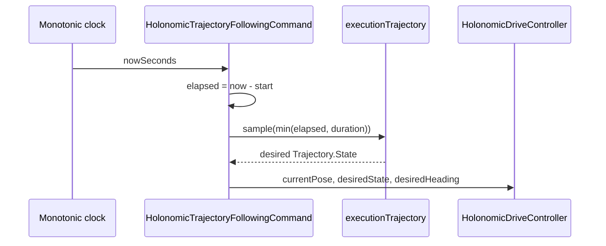

At initialization:

```text
startTime = current monotonic time
```

During each command execution cycle:

```text
t = currentTime - startTime
desiredState = trajectory.sample(t)
```

WPILib `Trajectory.sample(t)` returns the first state before the start, the last state after the
end, and otherwise locates and interpolates between neighboring states.

FRC robot programs are commonly discussed with a roughly 20 ms loop intuition:

```text
approximately 0 ms   -> sample near t=0.000 s
approximately 20 ms  -> sample near t=0.020 s
approximately 40 ms  -> sample near t=0.040 s
...
```

This is intuition, not an assertion that every current execution interval is exactly 20 ms. The
current follower uses elapsed monotonic FPGA time, not a hard-coded loop counter.

---

## 6. Desired pose versus actual EstimatedPose

### Why feedback exists

The trajectory describes the plan. The pose estimator describes where the robot is believed to
be. They will differ because of inertia, wheel slip, timing jitter, model error, steering error,
and disturbances. A follower uses that difference to correct tracking.

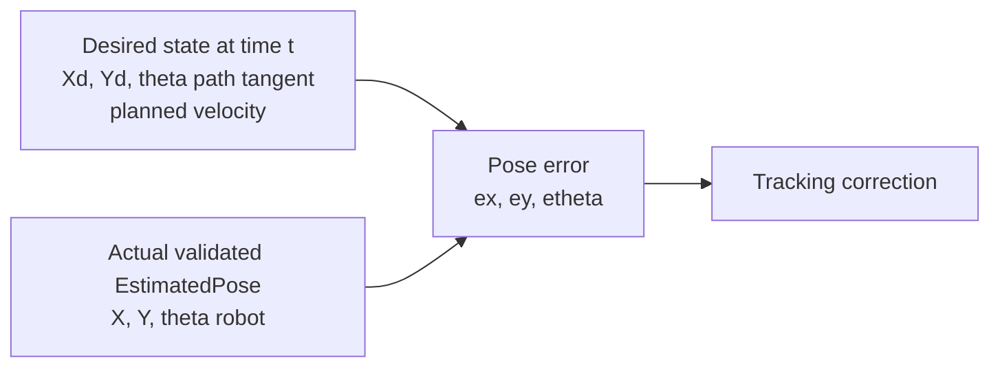

For teaching, define field-frame errors:

```text
ex     = Xd - X
ey     = Yd - Y
etheta = wrap(thetaDesired - theta)
```

The current follower passes the desired trajectory state, the validated current
`EstimatedPose`, and the separately transformed desired holonomic heading to WPILib's
`HolonomicDriveController`.

**VERIFIED validity boundary:** the follower refuses to control from an absent observation, an
absent estimated-pose observation, an invalid measurement sample, or a nonfinite pose.

---

## 7. Feedforward versus feedback

### Why both are needed

Feedforward says, "Move as the plan already says." Feedback says, "Correct the tracking error."
With feedforward alone, a disturbance can leave the robot behind. With feedback alone, the robot
would wait for position error before producing motion. Together:

```text
command approximately planned trajectory motion + tracking correction
```

```mermaid
flowchart LR
    T[Trajectory.State]
    FF[Translation feedforward<br/>v*cos(path tangent), v*sin(path tangent)]
    P[EstimatedPose]
    FB[X and Y PID feedback<br/>from desired minus actual]
    TH[Profiled theta controller<br/>toward desired holonomic heading]
    SUM[Field-relative desired motion]
    R[Convert using current robot heading]
    OUT[Robot-relative ChassisSpeeds]
    T --> FF --> SUM
    T --> FB
    P --> FB --> SUM
    P --> TH --> SUM
    SUM --> R --> OUT
```

**VERIFIED WPILib 2026.2.1 behavior:** `HolonomicDriveController` computes translational
feedforward from the desired linear velocity and trajectory-pose tangent, computes X/Y PID
feedback from current and desired field positions, adds those terms, computes a profiled heading
controller output, and returns robot-relative `ChassisSpeeds`.

### Robot behind the trajectory

**EXAMPLE ONLY:**

```text
planned vx = +0.40 m/s
Xd = 0.60 m
X  = 0.50 m
ex = +0.10 m
kP = 1.0 1/s
x correction = +0.10 m/s
unbounded sum = +0.50 m/s
```

The positive correction helps the robot catch up.

### Robot ahead of the trajectory

**EXAMPLE ONLY:**

```text
planned vx = +0.40 m/s
Xd = 0.60 m
X  = 0.70 m
ex = -0.10 m
x correction = -0.10 m/s
sum = +0.30 m/s
```

Negative correction does not automatically mean reverse motion. Here it only reduces the forward
command.

### When correction temporarily reverses the request

**EXAMPLE ONLY:**

```text
planned vx = +0.05 m/s
ex = -0.20 m
kP = 1.0 1/s
x correction = -0.20 m/s
sum = -0.15 m/s
```

The correction magnitude exceeds the planned forward term, so the requested X direction becomes
negative. That can be a legitimate attempt to recover from being far ahead. The current follower
then bounds total translation magnitude and angular speed; it does not claim that the path's
acceleration constraint independently clamps this feedback-generated change.

---

## 8. X, Y, and theta corrections are independent

### Why swerve makes this useful

A holonomic swerve drivetrain can translate in X, translate in Y, and rotate at the same time.
The controllers therefore address three different errors:

```text
ex     -> vx correction
ey     -> vy correction
etheta -> omega correction
```

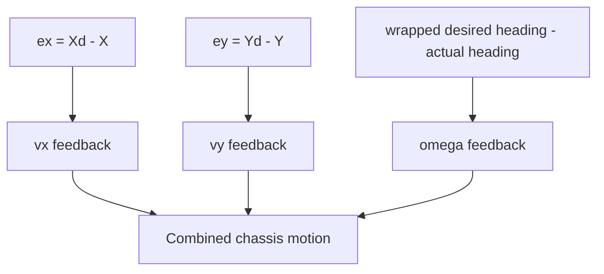

**EXAMPLE ONLY:** the plan moves field `+X`; the robot is too far in `+Y`; its heading is too
positive.

```text
planned translation:   +X
Y correction:          -Y
heading correction:    negative omega (clockwise)

result: vx > 0, vy < 0, omega < 0 at the same time
```

```text
TOP VIEW - field axes

               +Y
                ^
                |
        desired *---------------------> +X planned motion
                |\
                | \ combined translation request
                |  \
      actual R  o---\----------------->
                v
              -Y correction       clockwise heading correction
```

The controller output is then converted to the robot frame using the robot's current heading.

---

## 9. What ChassisSpeeds means

### Why this is an architectural boundary

`ChassisSpeeds` describes desired rigid-body motion of the chassis:

- `vxMetersPerSecond`: forward component in the stated reference frame;
- `vyMetersPerSecond`: left component in the stated reference frame;
- `omegaRadiansPerSecond`: counterclockwise angular component.

It is not a motor voltage, current, duty cycle, wheel speed, or steer angle.

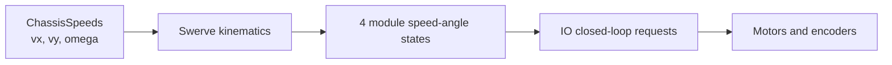

### Field-relative versus robot-relative

```text
FIELD-RELATIVE
+X and +Y stay fixed to the field, even when the robot turns.

ROBOT-RELATIVE
+X means robot-forward and +Y means robot-left, so the axes turn with the robot.
```

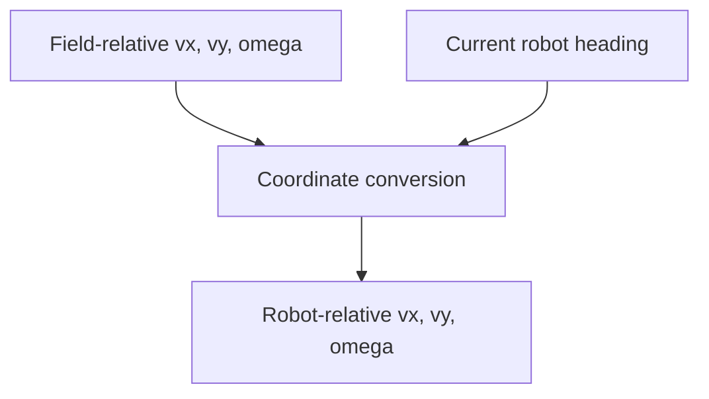

**VERIFIED current A01_L06 route:** `HolonomicDriveController.calculate(...)` returns
robot-relative `ChassisSpeeds`, and the follower submits them through
`SwerveSubsystem.acceptChassisSpeeds(...)`.

The subsystem also has `acceptFieldRelativeChassisSpeeds(...)` for other inherited production
paths. That method uses the subsystem-owned valid field-heading snapshot and performs the
field-to-robot conversion inside `SwerveSubsystem`. The current L06 follower does not submit its
already robot-relative result through that field-relative method.

---

## 10. Swerve kinematics: chassis motion to four vectors

### Why geometry matters

Translation contributes the same base vector to every module. Rotation contributes a tangential
vector whose direction and magnitude depend on the module's position from the robot center.

For a module at robot-relative location `(rx, ry)`:

```text
moduleVx = vx - omega * ry
moduleVy = vy + omega * rx

moduleSpeed = hypot(moduleVx, moduleVy)
moduleAngle = atan2(moduleVy, moduleVx)
```

Current geometry is **VERIFIED** as wheelbase `0.5461 m`, trackwidth `0.5461 m`, with module
locations ordered FL, FR, BL, BR at half-offsets `+/-0.27305 m`.

### A. Pure robot `+X` translation

```text
                       ROBOT FRONT +X
                            ^
                   FL  ^           ^  FR
                       |           |
                       |   ROBOT   |
                       |           |
                   BL  ^           ^  BR

All geometric module vectors: same speed, angle 0 deg (robot-forward).
```

### B. Pure robot `+Y` strafe

```text
              +Y robot-left <----------------

                   FL  <           <  FR
                       +-----------+
                       |   ROBOT   |
                       +-----------+
                   BL  <           <  BR

All geometric module vectors: same speed, angle +90 deg.
```

### C. Pure positive rotation

The vectors are tangent to circles around the robot center. The diagram below shows the geometric
states before current-angle optimization.

```text
                         FRONT

                   FL  ↖           ↗  FR
                       +-----------+
                       |     o     |       positive omega = CCW
                       +-----------+
                   BL  ↙           ↘  BR

FL  +135 deg     FR  +45 deg
BL  -135 deg     BR  -45 deg
equal geometric speed for the current square layout
```

If all current module angles are `0 deg`, optimization can represent the same force vectors as
negative speeds at shorter steering angles. That is why final optimized test states can look
different while remaining kinematically equivalent.

### D. Translation plus rotation

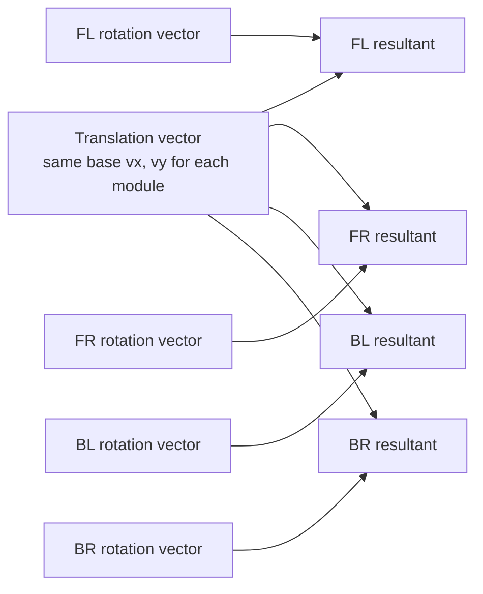

```text
Each final geometric vector = translation vector + that module's rotation vector.

Some modules become faster, some slower, and their angles differ.
The FL / FR / BL / BR array order must stay aligned with physical IO order.
```

`SwerveKinematics` delegates this conversion to WPILib `SwerveDriveKinematics`; the focused tests
verify zero, forward, left strafe, CCW rotation, combined motion, round-trip conversion, and fixed
FL/FR/BL/BR order.

---

## 11. Desaturation: scale every module proportionally

### Why not clamp just one wheel

Kinematics can request a wheel speed above the configured limit. If only the fastest wheel is
clamped, the ratios among the four vectors change, so the resulting chassis translation/rotation
blend is distorted. Proportional desaturation preserves the ratios.

Given **EXAMPLE ONLY** pre-desaturation absolute speeds:

```text
FL = 5.2 m/s
FR = 4.6 m/s
BL = 3.9 m/s
BR = 4.8 m/s
configured maximum = 4.0 m/s
```

```text
scale = allowed maximum / largest requested magnitude
scale = 4.0 / 5.2
scale approximately 0.76923
```

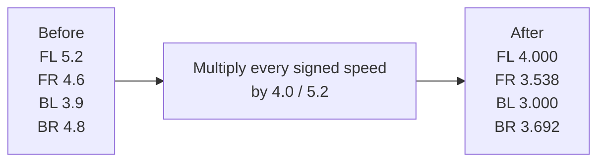

Angles are unchanged by desaturation. Signed speeds retain their signs. The current pipeline uses
WPILib `SwerveDriveKinematics.desaturateWheelSpeeds(...)`, and the installed source confirms that
all speeds are divided by the actual maximum and multiplied by the allowed maximum.

**VERIFIED current source order:** optimization occurs first, then proportional desaturation. The
focused pipeline test builds the optimized states, computes one scale, and checks that every final
speed equals its optimized speed multiplied by that scale.

---

## 12. Swerve module-state optimization

### Why reverse a wheel

A wheel force vector has an equivalent representation 180 degrees away if wheel speed is
reversed. Optimization uses that equivalence to reduce steering travel.

**EXAMPLE ONLY:**

```text
current module angle = 10 deg
desired state        = 170 deg at +2.0 m/s

direct steering travel = +160 deg
```

Rotate the target by 180 degrees and reverse speed:

```text
optimized target = 170 deg + 180 deg = 350 deg = -10 deg
optimized speed  = -2.0 m/s
steering travel  = -20 deg
```

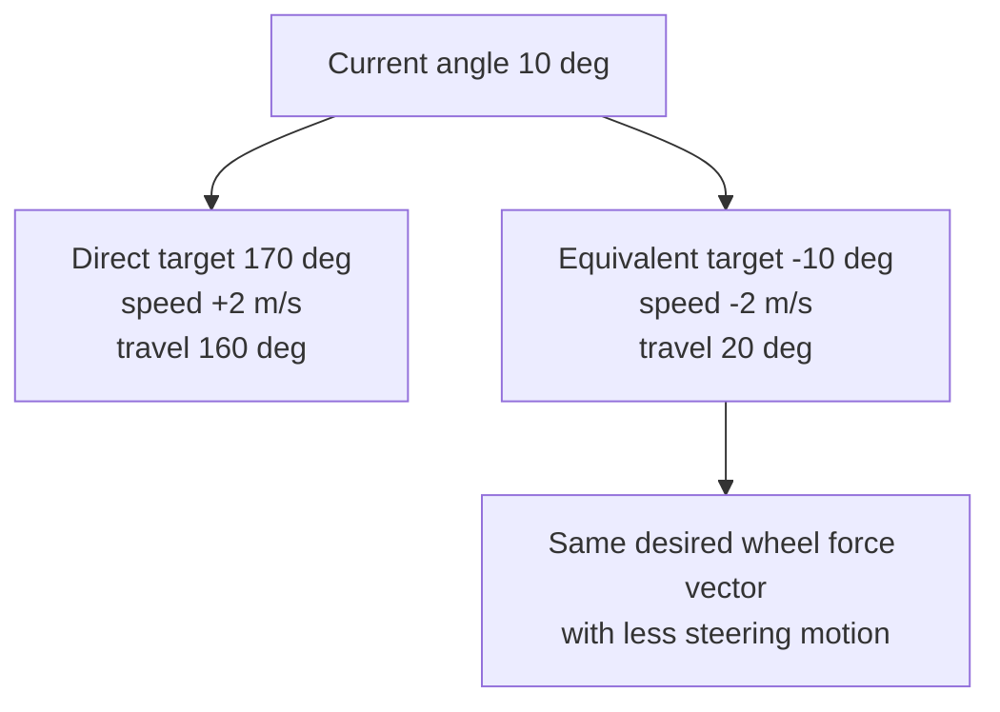

The installed WPILib 2026.2.1 `SwerveModuleState.optimize(currentAngle)` reverses speed and rotates
the desired angle by 180 degrees when the required angular change is greater than 90 degrees.
The repository wrapper copies the desired state before calling that supported instance method, so
caller-owned mutable state is not changed.

Optimization does not mean the robot is commanded to drive backward as a whole. It changes one
module's equivalent speed-angle representation.

---

## 13. Why CANcoder offsets matter

### Why the absolute zero is part of the control loop

The controller needs to know where each module actually points. A CANcoder magnet offset maps the
physical wheel-forward direction to the software's calibrated zero. The current CTRE IO configures
each steer Talon FX with its remote CANcoder, continuous wrap, and the corresponding calibrated
magnet offset.

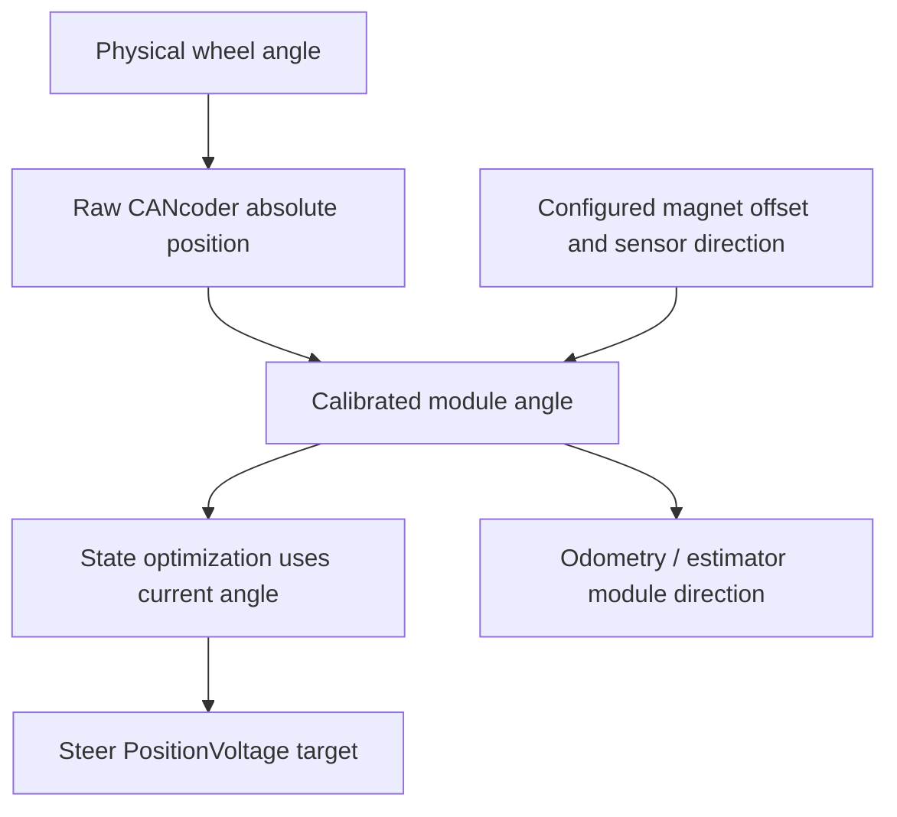

An incorrect zero affects several layers:

1. **Steering:** a requested `0 deg` does not produce a physically forward wheel.
2. **Optimization:** the software compares the target against the wrong current angle and may
   choose the wrong short path or speed sign.
3. **Wheel force:** the real floor-force vector points away from the kinematic vector.
4. **Tracking:** the chassis moves or rotates differently from the requested `ChassisSpeeds`.
5. **Odometry consistency:** measured wheel displacement is projected along the wrong angle, so
   estimated motion can disagree with field reality.

```text
REQUESTED FORCE                 WITH +5 deg ANGLE ERROR

      ^ physical +X                    / actual force
      |                               /
      | requested force              / 5 deg
      |                              /
      o                            o-------- requested direction
```

### All modules share the same +5 degree error

**EXAMPLE ONLY:** every module angle is reported 5 degrees away from physical truth. A pure
translation can be coherently rotated by about 5 degrees, producing sideways tracking error. The
odometry projection can share a systematic directional bias. The robot may look consistently
"crabbed."

### Every module has a different error

**EXAMPLE ONLY:** FL `+5 deg`, FR `-3 deg`, BL `+8 deg`, BR `-6 deg`. The vectors no longer form the
intended coherent set. Their force sum and torque sum can both change, producing unwanted
translation, rotation, scrub, and inconsistent odometry.

**VERIFIED recalibration concept:** the S00 commissioning record says offsets are physical
calibration values obtained from Phoenix Tuner X, synchronized into `Constants.java`, applied in
`SwerveModuleIOCTRE`, and checked against device readback. Current source and tests contain the
latest approved values. This guide does not invent replacement offsets. A future recalibration
must follow the same measured-evidence and source/test synchronization process.

---

## 14. Alliance transform: exactly one owner

### Why double transforms are dangerous

The asset is authored once in a canonical Blue-origin frame. The execution representation is then
derived for the definite alliance. If both A01 and PathPlanner flip the same data, the second
transform can undo or corrupt the intended result.

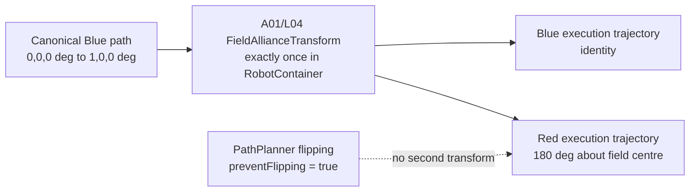

**VERIFIED current selected field variant:** `REBUILT_WELDED`, length `16.541 m`, width
`8.069 m`.

**VERIFIED current endpoints:**

```text
Blue: (0.000, 0.000, 0 deg) -> (1.000, 0.000, 0 deg)
Red:  (16.541, 8.069, 180 deg) -> (15.541, 8.069, 180 deg)
```

The Red robot therefore travels approximately one meter toward decreasing field X. This is the
alliance-transformed opposite-field execution, not a separately authored reversed path.

The adapter sets `path.preventFlipping = true`. It does not own alliance policy. The subsystem,
IO, and telemetry apply no hidden transform.

---

## 15. Heading wrap

### Why ordinary subtraction can be wrong

Angles are periodic:

```text
+180 deg is equivalent to -180 deg
+360 deg is equivalent to 0 deg
```

Suppose the desired heading is `-179 deg` and actual heading is `+179 deg`:

```text
naive error = -179 - 179 = -358 deg
wrapped error = +2 deg
```

The shortest correction is 2 degrees, not a 358-degree rotation.

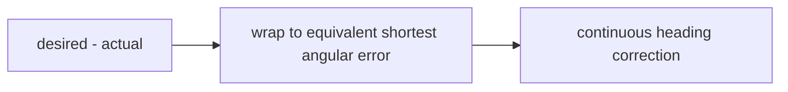

**VERIFIED current behavior:** the installed `HolonomicDriveController` enables continuous input
on its profiled theta controller. Repository pose-target and transform utilities also use WPILib
angle wrapping where they explicitly calculate angular differences.

---

## 16. Fail-closed control

### Why motion failures must become stop requests

Autonomous motion is safe only while all required facts remain valid. "Fail closed" means a bad
or missing fact removes motion authority and reaches the centralized stop path; the software does
not guess a pose, reuse stale intent, or automatically restart later.

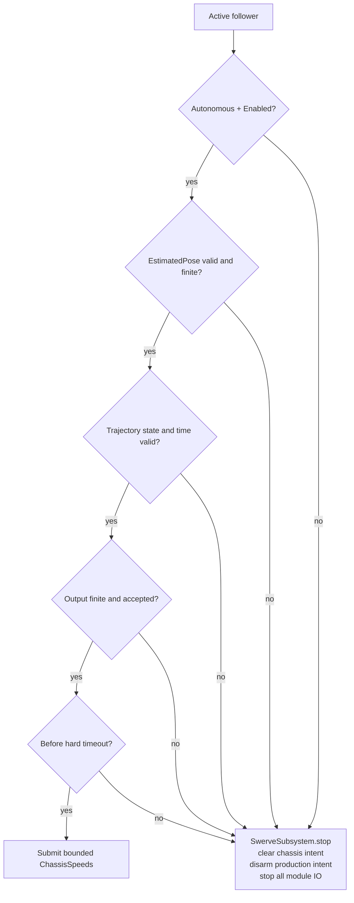

Current failure/termination cases include:

- mode loss (`DriverStation.isAutonomousEnabled()` becomes false);
- command cancellation or interruption (`end(...)` always stops);
- absent, invalid, or nonfinite estimated pose;
- null or nonfinite trajectory state;
- nonfinite or backward time;
- hard timeout;
- nonfinite controller output; and
- runtime output-submission failure.

Missing or malformed L06 assets and invalid PathPlanner trajectory data are caught before a valid
motion command is created; `RobotContainer` returns a stop-only branch.

`SwerveSubsystem.stop()` is the centralized authority. It clears retained chassis intent, changes
the reference frame back to robot-relative zero, disarms production intent, zeroes cached final
states, and calls each module IO stop path. A fresh accepted Disabled reset/context is required
for another autonomous session; mode recovery alone does not restart motion.

---

## 17. Path constraint versus hard physical command limit

### Why the distinction matters on a real robot

A trajectory acceleration constraint shapes the planned states. Feedback is calculated later from
tracking error. Therefore:

```text
trajectory max acceleration
    is not automatically equal to
an independent hard clamp on every runtime command acceleration
```

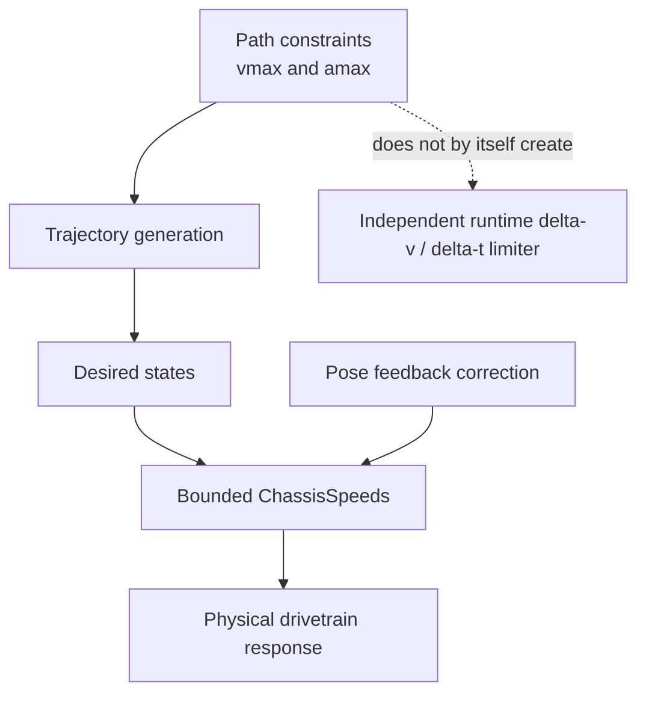

The current follower separately bounds:

- translation command magnitude to `0.50 m/s`; and
- angular command to `+/-0.75 rad/s`.

Those are speed bounds. The current follower does not implement a separate chassis command slew
or acceleration clamp that guarantees `|delta v / delta t| <= 1.00 m/s^2` after feedback is added.

Why this matters: Simulation can show that the software follows the configured model, but real
mass, MOI, friction, battery voltage, motor response, module calibration, and carpet can change the
physical acceleration and tracking behavior. Real-robot validation must therefore remain a
separate controlled gate.

---

## 18. Current A01_L06 one-meter learning example

### VERIFIED

- Asset: `A01_L06_OneMeter_Forward.path`.
- Runtime key: `A01_L06_OneMeter_Forward`.
- PathPlannerLib: `2026.1.2`; WPILib project baseline: `2026.2.1`, Java 17.
- Canonical Blue geometry: approximately `(0,0,0 deg) -> (1,0,0 deg)`.
- Selected field variant: `REBUILT_WELDED`.
- Constraints: `0.50 m/s`, `1.00 m/s^2`, `0.75 rad/s`, `1.50 rad/s^2`.
- Start and end ideal holonomic speed: zero.
- No rotation targets, point-towards zones, constraint zones, event markers, replanning,
  pathfinding, or multiple routines.
- A01/L04 owns one alliance transform; PathPlanner flipping is prevented.
- Current follower X/Y/theta gains are `1.0 1/s`; translation tolerance is `0.05 m`; heading
  tolerance is `3.0 deg`; timeout margin is `3.0 s` after trajectory duration.
- Focused L06 tests: user-supplied `18/18` PASS; inherited regression, full tests, clean build,
  Simulation, and Simulation/Glass evidence are recorded PASS in active lesson records.
- Post-recalibration real-robot L06 one-meter autonomous execution was user-verified on both Blue
  and Red. The Blue run showed slight endpoint overshoot followed by a small closed-loop reverse
  correction and settling near the intended endpoint; this is an observation only.

### PROVISIONAL

These are not measured or final:

- mass `45.0 kg`;
- MOI `5.0 kg*m^2`;
- PathPlanner maximum drive velocity model input `4.0 m/s`; and
- wheel COF `1.0`.

The inherited swerve output pipeline also uses a configured `4.0 m/s` wheel-speed cap. Its presence
does not prove the physical robot has been measured to reach 4.0 m/s.

Exact physical endpoint accuracy, including exact `1.000 m`, is not formally measured or claimed.
Final PID/feedforward and physical-model tuning are deferred. The configured `45.0 kg` mass is
provisional and known to exceed the user's current real-robot mass estimate; MOI, wheel COF, and
maximum drive velocity are also provisional. No single provisional value is proven to cause the
observed endpoint behavior.

### EXAMPLE ONLY

All arithmetic examples elsewhere in this guide - the `0.10 m` triangular profile, feedforward
and feedback sums, the `5.2/4.6/3.9/4.8 m/s` desaturation set, the `10 deg -> 170 deg`
optimization case, and the `+5 deg` CANcoder-error cases - teach concepts only. They do not report
current robot measurements.

### Current one-meter story

```text
Canonical Blue asset
    -> PathPlanner-generated finite states
    -> validated native WPILib Trajectory
    -> one L04 alliance transform
    -> sample at elapsed time
    -> planned translation + pose feedback + heading control
    -> robot-relative ChassisSpeeds
    -> kinematics
    -> per-module optimization
    -> proportional desaturation
    -> FL / FR / BL / BR IO requests
    -> CTRE hardware or idealized Simulation
```

---

## 19. Knowledge check

Answer these without looking at the key.

1. What question does a path answer, and what extra question does a trajectory answer?
2. Why might a short path never reach its maximum velocity constraint?
3. In `v^2 = v0^2 + 2as`, what does increasing available distance allow when acceleration is
   fixed?
4. What does `trajectory.sample(t)` return, and how is `t` obtained in the current follower?
5. If the robot is `0.10 m` behind the desired X position, what is the sign of X feedback
   correction for a positive proportional gain?
6. If the robot is `+0.20 m` too far in field Y, what is the sign of the Y correction?
7. Why does a negative correction not always mean the final command reverses direction?
8. What three quantities does `ChassisSpeeds` represent, and why are they not motor commands?
9. In current L06, is the output of `HolonomicDriveController.calculate(...)` submitted as
   field-relative or robot-relative chassis speeds?
10. For pure positive rotation, how are the four pre-optimization module vectors oriented?
11. Why must all module speeds be desaturated proportionally instead of clamping only the fastest
    module?
12. Why can swerve optimization reverse wheel speed?
13. How can a wrong CANcoder offset affect both tracking and odometry?
14. Why is `+180 deg` equivalent to `-180 deg`, and what can go wrong without heading wrapping?
15. Why must the alliance transform happen exactly once?
16. What is the current source order of kinematics, optimization, and desaturation?
17. Why is the path acceleration constraint not a guaranteed hard physical command-acceleration
    clamp?
18. Name at least four conditions that must fail closed through centralized stop behavior.

## Answer key

1. A path answers where to travel. A trajectory adds where the robot should be at time `t` and
   how fast it should be moving.
2. It may need to accelerate from rest and decelerate to rest with too little distance to reach the
   ceiling.
3. More distance permits velocity to grow farther before braking is required; it may make a cruise
   segment possible.
4. It returns the trajectory state belonging at that elapsed time, interpolating when necessary.
   Current `t` is monotonic current time minus the recorded start time.
5. Positive: `ex = Xd - X` is positive.
6. Negative: desired Y minus actual Y is negative.
7. Correction is added to planned motion. A small negative correction can merely reduce a larger
   positive feedforward term.
8. `vx`, `vy`, and `omega` describe desired chassis translation and rotation in a stated frame.
   Kinematics and IO still must convert them into per-module speed/angle and hardware requests.
9. Robot-relative. The WPILib controller performs the field-to-robot conversion before returning
   `ChassisSpeeds`, and L06 calls `acceptChassisSpeeds(...)`.
10. They are tangent to circles around the center: FL northwest, FR northeast, BL southwest, BR
    southeast for the current square geometry before optimization.
11. One-wheel clamping changes relative vector magnitudes and distorts the requested chassis
    motion. Common scaling preserves ratios.
12. A vector at angle `theta` with positive speed is equivalent to a vector at `theta + 180 deg`
    with negative speed. The second representation may require less steering travel.
13. It changes the believed current module direction used by optimization and steering, rotates the
    real force vector away from the request, and projects wheel displacement along a wrong angle
    in localization.
14. They identify the same direction on a periodic circle. Without wrapping, a 2-degree shortest
    correction can be mistaken for a 358-degree correction.
15. The asset is canonical Blue data. Applying both L04 transform and PathPlanner flipping would
    double-transform the plan and break frame ownership.
16. `SwerveKinematics` -> per-module optimization -> proportional desaturation.
17. The constraint shapes planned states, while feedback is added during execution; current code
    has speed bounds but no separate chassis command slew/acceleration limiter enforcing the path
    acceleration after feedback.
18. Any four of: mode loss, cancellation/interruption, invalid or absent pose, invalid state,
    nonfinite or backward time, timeout, nonfinite output, submission failure, missing/malformed
    asset, or trajectory-generation/validation failure.

---

## 20. Final mental model

The core lesson is not merely "PathPlanner drives the robot." The accurate mental model is:

> A canonical path supplies geometry and constraints. PathPlanner produces a finite trajectory.
> A01 applies one alliance transform. The follower samples the desired state at elapsed time,
> combines planned motion with validated pose correction, and requests robot-relative chassis
> motion. The subsystem converts that intent into optimized and proportionally desaturated module
> states, then vendor-neutral IO sends safe closed-loop requests to CTRE hardware or Simulation.
> At every loss of required validity or mode authority, centralized `SwerveSubsystem.stop()` wins.

That model keeps trajectory mathematics, feedback control, swerve geometry, calibration,
hardware abstraction, and safety ownership connected without collapsing them into one opaque
"drive path" operation.
