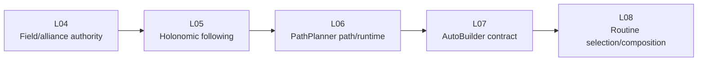
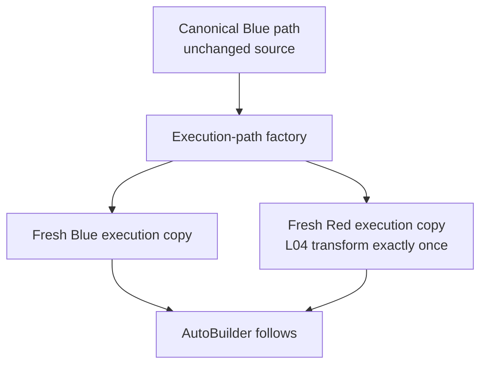
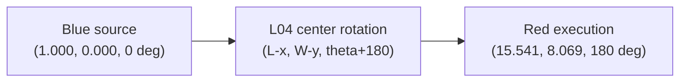
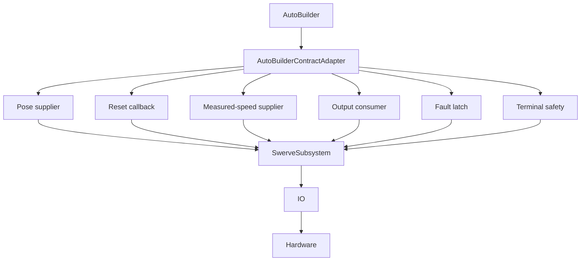
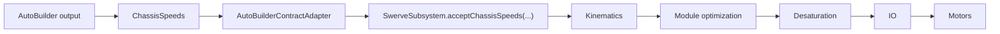

# A01_L07 - AutoBuilder Contract Integration

## Full Learning Guide

Audience: a new FRC mentor or student who knows basic Java and WPILib, but may
never have attended an FRC match.

This guide explains the current L07 architecture and the user-supplied
Simulation evidence. It is a learning document, not a competition tuning
record. L07 is still `IN_PROGRESS / EDITABLE`; real-robot verification is
`DEFERRED / NOT TESTED`.

## How to use this guide

Read the **why** before the **how**. In an FRC robot, the same visible motion
can be produced by different software boundaries. L07 is valuable because it
changes the integration boundary while deliberately keeping the known
one-meter behavior recognizable.

The exact deployed path asset in this repository is
`A01_L06_OneMeter_Forward.path`. Some planning notes use the shorter phrase
`A01_L06_OneMeter.path`; both refer to the known one-meter learning path, not a
new L07 asset.

---

## 1. Where L07 fits in the roadmap

Each A01 lesson adds one understandable concept:

| Lesson | Main responsibility |
|---|---|
| L04 | Owns field geometry and the Blue/Red alliance transform contract. |
| L05 | Follows a holonomic trajectory using the existing drivetrain contracts. |
| L06 | Loads one PathPlanner path and connects its runtime data to the learned follower/safety boundary. |
| L07 | Configures AutoBuilder against the existing pose, reset, speed, output, requirement, and safety contracts. |
| L08 | Will select and safely compose multiple autonomous routines. |



The same sequence as a simple text diagram is:

```text
L04  ->  L05  ->  L06  ->  L07  ->  L08
frame    follow  path     contract  routines
```

L07 does not authorize chooser code, multiple routines, NamedCommands, event
markers, vision, AprilTags, pathfinding, replanning, or a new mechanism
architecture. Those are later or separately governed concerns.

### Common misunderstanding

**Misunderstanding:** “Because AutoBuilder is a powerful framework, L07 must
also add every autonomous feature.”

**Correction:** L07 adds one concept: the contract boundary. L08 owns routine
selection and safe composition; L09 owns NamedCommands and event markers.

---

## 2. The most important question: L06 versus L07

L06 and L07 can look almost identical in Simulation because both use the same
known one-meter autonomous. That similarity is intentional regression
evidence, not proof that the lessons are duplicates.

| Contract question | L06 | L07 |
|---|---|---|
| Lesson objective | Prove that a real PathPlanner `.path` asset can enter the runtime architecture. | Prove that AutoBuilder can be configured through controlled repository contracts. |
| Path loading | `PathPlannerTrajectoryAdapter` loads and validates the known path. | The same adapter supplies the canonical path to the L07 boundary. |
| Trajectory execution | The L06 runtime path feeds the learned follower boundary. | `AutoBuilder.followPath(...)` creates the vendor path command. |
| AutoBuilder | Not used. | Configured exactly once through `AutoBuilderContractAdapter`. |
| Pose supplier | Existing subsystem pose/follower contract. | `SwerveSubsystem.getEstimatedPose()` is bridged to a concrete callback. |
| Measured-speed supplier | Existing measured-speed contract supports runtime integration. | `SwerveSubsystem.getMeasuredRobotRelativeSpeeds()` supplies the callback value. |
| Output consumer | Existing follower output reaches the subsystem. | AutoBuilder `ChassisSpeeds` reaches `SwerveSubsystem.acceptChassisSpeeds(...)`. |
| Requirement ownership | `SwerveSubsystem` owns the drivetrain requirement. | The same `SwerveSubsystem` is passed to AutoBuilder and the safety wrapper. |
| Alliance-flipping protection | L04 owns the transform and PathPlanner flipping is prevented. | L04 transforms a fresh execution path; `preventFlipping=true` and `shouldFlipPath=false`. |
| Lifecycle/fault safety | Existing fail-closed and centralized-stop contracts. | Fault latch, timeout, mode-loss handling, and terminal stop surround AutoBuilder. |
| Visible robot behavior | Known one-meter path. | The same known one-meter path, now through the AutoBuilder contract. |

```text
L06 question:
  Can a PathPlanner asset enter the established runtime safely?

L07 question:
  Can AutoBuilder use the established pose/reset/speed/output/safety contracts
  without becoming the owner of the robot?
```

### Worked analogy

Imagine a lamp that still turns on and emits the same light. L06 teaches how
the bulb and wiring connect to the house. L07 replaces the control switch with
a framework adapter while keeping the house wiring, safety breaker, and lamp
ownership intact. The outside result can be the same while the integration
boundary is different.

### Common misunderstanding

**Misunderstanding:** “If the Simulation trace looks the same, L07 added
nothing.”

**Correction:** The trace is a regression oracle. L07 changes who constructs
the path command and how callbacks, requirements, and faults are controlled.

---

## 3. The canonical path

Canonical means the authoritative original geometry. A beginner-friendly
translation is **original source path**. In Vietnamese learning material, the
preferred phrase is **đường đi chuẩn gốc**.

For this project, the canonical asset is the known Blue-frame one-meter path:

```text
src/main/deploy/pathplanner/paths/A01_L06_OneMeter_Forward.path
```

Its important meaning is:

```text
CANONICAL PATH  =  ORIGINAL SOURCE
EXECUTION PATH  =  FRESH COPY USED FOR ONE RUN
```

The canonical path is not a temporary object to edit for Red. The factory
creates a fresh copy, transforms that copy when the alliance is Red, and marks
the copy as already transformed.



### Why mutation is dangerous

Suppose the same object is transformed to Red and then reused for a later Blue
run. Blue would no longer start from the authoritative Blue geometry. A second
Red run could transform already transformed data again. Fresh copies make the
ownership and lifetime obvious.

### Common misunderstanding

**Misunderstanding:** “Blue needs no copy because it is already correct.”

**Correction:** L07 still creates a fresh Blue execution path. The copy makes
the rule uniform and proves that the source object is never mutated.

---

## 4. The FRC field coordinate system

The FRC field has one absolute coordinate frame. Blue and Red do not receive
separate coordinate systems, and choosing an alliance does not move the field
origin.

`Pose2d` always describes a robot in the common field frame:

```text
                  +Y (90 deg)
                   ^
                   |
                   |
  origin (0,0) ----+-----------------> +X (0 deg)
                  /
             -90 deg

  180 deg points along -X.
```

The useful heading map is:

| Heading | Direction |
|---:|---|
| `0 deg` | `+X` |
| `90 deg` | `+Y` |
| `180 deg` | `-X` |
| `-90 deg` | `-Y` |

“Left” and “right” from a driver standing behind the alliance wall are human
viewing descriptions, not substitutes for field coordinates. A path should be
explained using `(x, y, heading)` and the selected field variant.

### Common misunderstanding

**Misunderstanding:** “Red has its own origin, so selecting Red rotates the
coordinate system.”

**Correction:** The field frame remains absolute. The path geometry is mapped
to the equivalent physical location on the same field.

---

## 5. Why Red needs a 180-degree transform

The current L04 contract rotates the geometry 180 degrees about the center of
the selected field variant. It does not rotate the coordinate system.

For a field length `L`, field width `W`, and canonical Blue pose `(x, y, theta)`:

```text
Red pose = (L - x, W - y, theta + 180 deg)
```

For the current `REBUILT_WELDED` dimensions:

```text
L = 16.541 m
W = 8.069 m
```

Worked one-meter example:

```text
Canonical Blue endpoint = (1.000, 0.000,   0 deg)
Expected Red endpoint   = (15.541, 8.069, 180 deg)
```

The supplied L07 Simulation ended at:

```text
Observed Red EstimatedPose = (15.535553, 8.069000, -180 deg)
```

`+180 deg` and `-180 deg` represent the same direction modulo 360 degrees.
The small X difference is recorded as Simulation geometry evidence only. It is
not a final endpoint-accuracy or dynamics measurement.



### Common misunderstanding

**Misunderstanding:** “The `-180 deg` result proves the robot turned the wrong
way.”

**Correction:** `-180` and `+180` are equivalent headings. The coordinate
transform, not the sign spelling, is the important fact.

---

## 6. Heading reference and the BACK button

Three ideas must be separated:

1. **Absolute field heading:** the robot's orientation in the common field
   frame.
2. **Raw gyro reading:** the sensor's local angle measurement.
3. **Heading reference:** the stored relationship that lets the subsystem map
   the raw sensor reading to the field heading.

The inherited BACK/View binding is a Disabled-only operator action. The
operator physically aligns the robot to a known field orientation, then BACK
captures the sensor-to-field relationship.

```text
FIELD HEADING       = absolute field orientation
RAW GYRO ZERO       = sensor-local reading
BACK                = establish sensor-to-field relationship
ALLIANCE            = choose execution geometry
```

BACK is not “select Blue,” not “select Red,” and not “rotate Red by 180
degrees.” Alliance selection and heading reference are different contracts.

If the physical sensor/reference remains valid, changing Blue to Red does not
conceptually require recapturing the gyro reference. The path geometry changes;
the field coordinate frame and the sensor relationship do not.

### Common misunderstanding

**Misunderstanding:** “Pressing BACK is how the robot learns the Red
transform.”

**Correction:** BACK establishes field heading from the sensor. L04 transforms
canonical path geometry based on alliance and field dimensions.

---

## 7. AutoBuilder in beginner-friendly terms

AutoBuilder is a framework integration point. It needs answers to six practical
questions:

| AutoBuilder question | Current answer |
|---|---|
| Where is the robot? | `SwerveSubsystem.getEstimatedPose()`. |
| How can localization be reset? | `SwerveSubsystem.resetKnownFieldPose(...)`, still Disabled-only. |
| How fast is the robot moving? | `SwerveSubsystem.getMeasuredRobotRelativeSpeeds()`. |
| How do I command chassis motion? | `SwerveSubsystem.acceptChassisSpeeds(...)`. |
| Who owns the drivetrain requirement? | The existing `SwerveSubsystem` instance. |
| Should the vendor flip the path? | No: `shouldFlipPath = false`; L04 owns the transform. |

AutoBuilder does not automatically know the project's safety rules. The
adapter supplies the answers and enforces the boundaries around them.

---

## 8. The AutoBuilder Contract Adapter

`AutoBuilderContractAdapter` is a narrow integration and safety boundary. It
translates between vendor callback shapes and the repository's established
contracts.



AutoBuilder must not directly own TalonFX, CANcoder, Pigeon, module
kinematics, Swerve IO, or the localization estimator implementation. Those
responsibilities remain below the public `SwerveSubsystem` boundary.

### Why a narrow adapter helps

If a vendor API changes, the adapter is the place where callback differences
are reviewed. If a safety rule changes, the adapter's fault and terminal-stop
behavior is visible. The rest of the robot does not need to know which vendor
framework constructed the command.

---

## 9. Optional-to-vendor contract mismatch

Repository APIs use `Optional` when a value may not be trustworthy:

```java
Optional<Pose2d> pose = swerveSubsystem.getEstimatedPose();
Optional<ChassisSpeeds> speed = swerveSubsystem.getMeasuredRobotRelativeSpeeds();
```

`Optional.empty()` means: **we do not currently have a trustworthy value**.
It does not mean “use the origin” or “assume the robot is stopped.”

Vendor callback APIs may require a concrete `Pose2d` or `ChassisSpeeds`. The
adapter therefore validates values before a command can start and latches a
fault if values disappear or become non-finite during execution.

```text
invalid or missing observation
            |
            v
       fault latch
            |
            v
          stop()
            |
            v
      no further actuation
```

The adapter's fallback pose and zero speeds exist only to satisfy a callback
after the output gate has closed. They never make an invalid localization
valid and never authorize continued motion.

### Worked example

```text
Estimated pose present and finite -> command may be created.
Estimated pose empty              -> stop command; no fabricated origin.
Measured speed non-finite          -> fault, stop, no continued output.
```

### Common misunderstanding

**Misunderstanding:** “A fallback value makes AutoBuilder more robust.”

**Correction:** A fallback can prevent a callback crash after output is
disabled, but it must never bypass the precondition that the robot state is
trustworthy.

---

## 10. PathPlannerExecutionPathFactory

`PathPlannerExecutionPathFactory` is separate from the adapter because it has a
different responsibility.

| Component | Responsibility | Kind of work |
|---|---|---|
| Factory | Validate canonical path, copy geometry, apply L04 transform once. | Pure geometry/copy/validation. |
| Adapter | Configure callbacks, create command, latch faults, enforce lifecycle and stop. | Runtime integration/safety. |

This is the Single Responsibility Principle: a component should have one clear
reason to change.

For Blue, the factory creates a fresh geometrically equal path. For Red, it
creates fresh transformed waypoints and headings. The original canonical path
remains unchanged in both cases.

---

## 11. `preventFlipping`

In this project:

```java
executionPath.preventFlipping = true;
```

means:

> This execution path has already been assigned the correct geometry. PathPlanner
> must not flip it again.

It is one protection against double transformation. It does not itself perform
the Red transform. L04 performs that transform before the flag is set.

---

## 12. `shouldFlipPath`

`shouldFlipPath = false` is the AutoBuilder-level policy. It tells AutoBuilder
not to apply a second vendor alliance flip.

The two gates work together:

```text
L04 creates correct geometry
          |
          v
executionPath.preventFlipping = true
          |
          v
AutoBuilder shouldFlipPath = false
          |
          v
NO vendor second transform
```

Disabling vendor flipping is not a missing feature. It is the deliberate
ownership decision required by the A01 architecture.

---

## 13. Double transform

The forbidden sequence is:

```text
Blue canonical path
    -> L04 Red transform
    -> PathPlanner Red flip again
    -> geometry may move toward a second/reflected result
```

The result could be equivalent to returning toward Blue geometry, using the
wrong field dimensions, or producing a path that no longer matches the reset
pose. The exact failure depends on which transform is applied twice, but the
architecture rule is simpler: exactly one owner is allowed.

### Common misunderstanding

**Misunderstanding:** “Two transforms make Red safer.”

**Correction:** A transform is not a safety margin. Applying it twice creates
an unverified geometry error.

---

## 14. Pose supplier

AutoBuilder needs the robot's current estimated pose to calculate pose error.
The current source is:

```text
SwerveSubsystem.getEstimatedPose()
```

At a beginner level:

```text
target pose
- estimated pose
= pose error
```

The error tells the controller whether the robot is ahead, behind, left,
right, or rotated relative to the planned state. The adapter copies and
validates the pose rather than exposing mutable internal state.

---

## 15. Measured robot-relative speed

The current speed source is:

```text
SwerveSubsystem.getMeasuredRobotRelativeSpeeds()
```

**Field-relative** speed describes motion along the fixed field axes. **Robot-
relative** speed describes motion along the robot's current forward/side axes.

```text
Field-relative:  +X and +Y belong to the field.
Robot-relative:  vx means robot-forward; vy means robot-left/right boundary
                 according to the drivetrain convention.
```

The AutoBuilder drivetrain contract uses measured robot-relative
`ChassisSpeeds` at this boundary because the drivetrain owns the conversion
from chassis intent to module states. The adapter must not substitute commanded
speed for measured speed.

---

## 16. Output consumer

AutoBuilder does not command individual motors. Its output is a chassis-level
request:



This preserves the Frozen Backbone and the Swerve subsystem's ownership of
kinematics, module optimization, actuation, and centralized stop.

---

## 17. Requirement ownership

WPILib's scheduler uses subsystem requirements to decide which command may
control a resource. The L07 command must require the existing
`SwerveSubsystem`.

```text
Command A requires SwerveSubsystem
Command B requires SwerveSubsystem
                 |
                 v
The scheduler cannot safely run both as independent drivetrain owners.
```

If a second subsystem instance were created, the scheduler would not see the
real conflict. That is why `RobotContainer` injects one composed
`SwerveSubsystem`, AutoBuilder receives that same instance, and the safety
wrapper preserves the requirement.

---

## 18. Fault latch

A monotonic latch moves in one direction for the process session:

```text
VALID SESSION
     |
     v
bad pose / bad speed / mode loss / invalid output
     |
     v
FAULT
     |
     v
stop()
     |
     v
remain faulted; no automatic restart
```

L07 intentionally has no production `resetFault()` API. A process restart is
the baseline reset boundary. Telemetry, rescheduling, alliance changes, and a
second configuration attempt cannot clear the latch.

### Common misunderstanding

**Misunderstanding:** “Re-enabling Autonomous should make a stopped command
try again.”

**Correction:** After a mode-loss fault, a fresh operator readiness procedure
and a new accepted command are required. L07 does not restart automatically.

---

## 19. Terminal stop

Path complete and drivetrain definitely stopped are different statements.
The vendor command may report completion while a previously issued output still
exists. L07 therefore wraps AutoBuilder execution with explicit terminal safety.

The stop boundary covers:

| Termination path | Required result |
|---|---|
| Normal completion | Delegate ends, then centralized `SwerveSubsystem.stop()`. |
| Disable or mode loss | Stop immediately and finish; no restart. |
| Cancellation/interruption | Delegate ends and centralized stop runs. |
| Timeout | Fault latch, stop, finish. |
| Invalid pose/speed/output | Fault latch, stop, no continued actuation. |
| Exception | Fault latch, stop, finish safely. |

```text
AutoBuilder command
       +
explicit SafeAutoBuilderCommand
       |
       v
centralized SwerveSubsystem.stop()
```

---

## 20. Actual Simulation evidence

The following facts are user-supplied evidence for the current L07
implementation:

| Check | Result | What it proves |
|---|---|---|
| Blue autonomous | PASS | Starting readiness, valid pose, and known one-meter execution work in Simulation. |
| Red autonomous | PASS | The transformed execution geometry reaches the expected side of the same field. |
| Exactly-one transform | PASS | Red geometry is consistent with the L04 transform and no vendor second flip. |
| Disable/mode-loss stop | PASS | Blue stopped near `(0.400765, 0, 0 deg)` when disabled mid-path. |
| No automatic restart | PASS | Re-enable without BACK, reset, or fresh readiness did not resume motion. |
| Pose validity | PASS | EstimatedPose was available and valid for the run. |
| Heading stability | PASS | Blue heading remained `0 deg`; Red final heading was `-180 deg`, equivalent to `+180 deg`. |

Red final EstimatedPose:

```text
X = 15.535553 m
Y = 8.069000 m
Heading = -180.000000 deg
```

The expected approximate endpoint is `(15.541 m, 8.069 m, +/-180 deg)`. This
comparison is geometry evidence, not precision characterization.

---

## 21. Why L07 looks like L06

Visible behavior:

```text
L06: robot drives the known one-meter path.
L07: robot drives the same known one-meter path.
```

Internal responsibility:

```text
L06: PathPlanner asset/runtime integration.
L07: AutoBuilder contract and lifecycle integration.
```

This is like changing the wiring and control architecture behind a machine
while keeping the machine's external behavior unchanged. That is a good
regression result: the new boundary did not disturb the known behavior.

---

## 22. Real-robot status

L06 real robot:

```text
Blue: PASS after recalibration
Red:  PASS after recalibration
Exact endpoint accuracy: not claimed
Final PID/FF and physical-model tuning: deferred
```

L07 real robot:

```text
NOT YET TESTED
Planned by the user for Monday.
```

Therefore L07 remains:

```text
IN_PROGRESS / EDITABLE
```

It is not `COMPLETE`, `FROZEN`, or `READ-ONLY`.

---

## 23. Current Swerve and RobotConfig values

Authoritative Swerve calibration:

| Value | Current authority |
|---|---:|
| Drive ratio | `6.75:1` |
| FL CANcoder offset | `+0.068603515625` rotations |
| FR CANcoder offset | `+0.014404296875` rotations |
| BL CANcoder offset | `+0.46240234375` rotations |
| BR CANcoder offset | `-0.057373046875` rotations |

The current PathPlanner `RobotConfig` physical values are intentionally:

```text
mass                 = 45.0 kg
moment of inertia    = 5.0 kg*m^2
maximum drive speed  = 4.0 m/s
wheel COF            = 1.0
```

These values are **PROVISIONAL / UNMEASURED / NOT FINAL**. Final dynamics,
PID, and feedforward tuning are deferred. The provisional mass must not be
reported as the proven cause of an earlier overshoot observation.

---

## 24. Model versus real robot

Simulation proves architecture and logic under a controlled model. A real robot
adds physical facts that the model cannot guarantee:

```text
Simulation -> contracts, transforms, lifecycle, scheduler, logic
Real robot  -> motor response, traction, inertia, wiring, CAN, geometry, mass,
              battery behavior, and actual dynamics
```

A Simulation PASS is necessary evidence, but it does not automatically become a
real-robot PASS. The user owns Driver Station procedure, emergency-stop/Disable
readiness, safe speed limits, physical rollback, and real-robot verification.

### Common misunderstanding

**Misunderstanding:** “The simulated endpoint is close, so final PID is known.”

**Correction:** The supplied Red result validates geometry behavior. It does
not measure final physical accuracy or identify the cause of any overshoot.

---

## 25. Knowledge check

Answer these before treating the L07 concept as understood.

1. What is the canonical path?
2. Why does L07 create a fresh Blue execution copy even when Blue needs no
   geometric transform?
3. Does selecting Red create a second field coordinate system?
4. What does `0 deg` mean in the field frame?
5. For `L=16.541`, `W=8.069`, what is the Red pose for Blue `(1,0,0 deg)`?
6. Why are `+180 deg` and `-180 deg` equivalent in the observed Red result?
7. What does the BACK button establish?
8. Is BACK the Blue/Red selector?
9. What six questions does AutoBuilder need answered at this boundary?
10. What is the purpose of `AutoBuilderContractAdapter`?
11. What does `Optional.empty()` mean for pose or measured speed?
12. Why must a fallback pose never authorize motion?
13. Which component owns the one alliance transform?
14. What do `preventFlipping=true` and `shouldFlipPath=false` prevent?
15. Which object owns the drivetrain scheduler requirement?
16. What happens after a fault latch is set?
17. Name four terminal paths that must call centralized stop.
18. What did the Blue mid-path Disable prove?
19. Why did re-enable not restart the simulated robot?
20. Why does Simulation PASS not equal L07 real-robot PASS?

### Answer key

1. The authoritative original Blue-frame path, currently
   `A01_L06_OneMeter_Forward.path`.
2. A fresh copy keeps source ownership uniform and proves the canonical object
   is never mutated.
3. No. Red is transformed into the same absolute field frame.
4. Heading along `+X`.
5. Approximately `(15.541, 8.069, 180 deg)`.
6. They differ by 360 degrees and point in the same direction.
7. It captures the sensor-to-field heading relationship while Disabled.
8. No. Alliance selection chooses execution geometry; BACK establishes heading
   reference.
9. Robot pose, reset callback, measured robot-relative speed, chassis output,
   drivetrain requirement, and vendor-flip policy.
10. It bridges vendor callbacks to existing Swerve contracts and owns fault and
    terminal safety.
11. The subsystem does not currently have a trustworthy value.
12. It would invent localization state and could authorize motion from false
    information.
13. `A01/L04 FieldAllianceTransform`.
14. They prevent a second PathPlanner/vendor alliance transform.
15. The existing `SwerveSubsystem` instance.
16. It stops the drivetrain, remains faulted for the session, and rejects
    automatic continuation.
17. Completion, cancellation/interruption, Disable/mode loss, timeout, fault,
    or exception.
18. The active path stopped before its endpoint and did not continue while
    Disabled.
19. The fault/readiness contract requires fresh readiness; L07 has no automatic
    restart.
20. A model cannot prove real motor response, traction, CAN behavior, wiring,
    geometry, mass, or final dynamics.

## Final learning summary

L06 proved that one real PathPlanner path can enter the runtime architecture.
L07 proved that AutoBuilder can use the robot's existing pose, reset, measured
speed, output, requirement, alliance, fault, and terminal-stop contracts. The
robot can look the same while the architecture becomes more controlled. That
is the point of this lesson.
