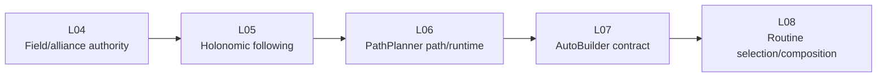
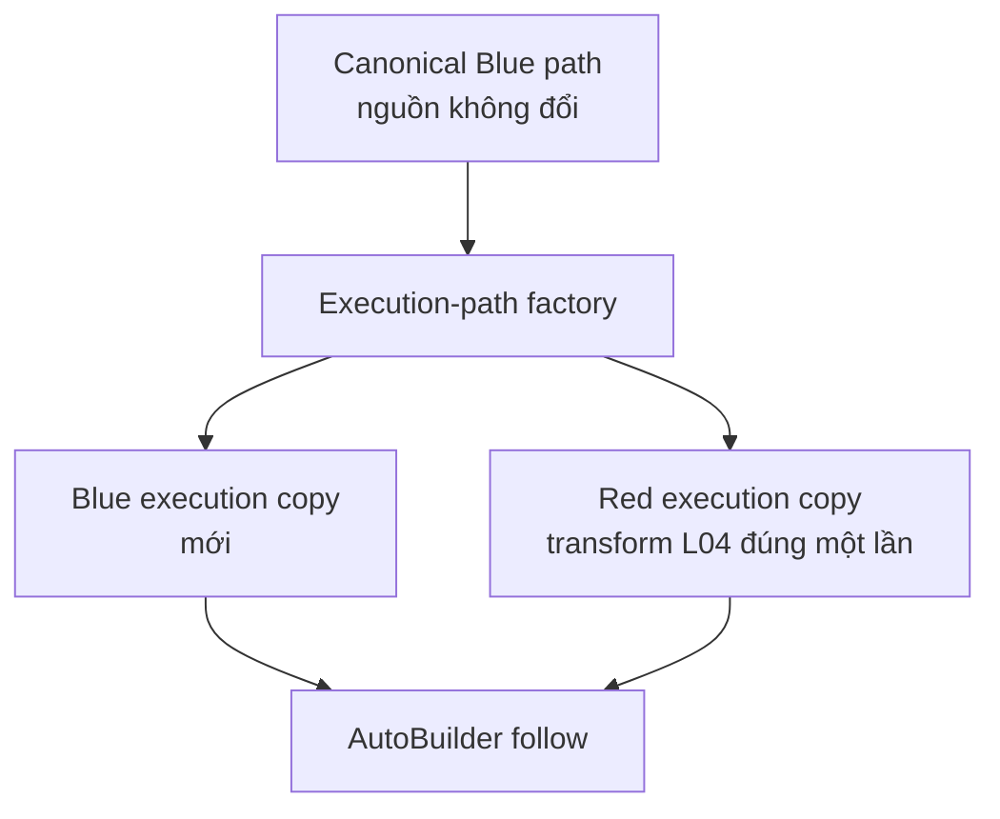
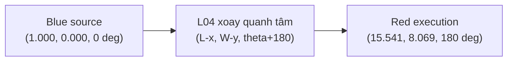
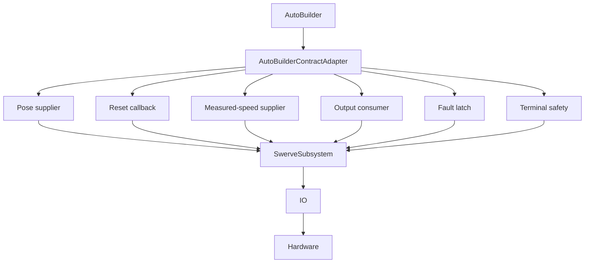
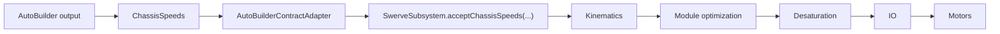

# A01_L07 - Tích hợp hợp đồng AutoBuilder

## Tài liệu học đầy đủ

Đối tượng: mentor hoặc học viên mới biết Java và WPILib cơ bản, nhưng có thể
chưa từng tham dự một trận FRC.

Tài liệu này giải thích kiến trúc L07 hiện tại và bằng chứng Simulation cùng
robot thật do người dùng cung cấp. Đây là tài liệu học, không phải hồ sơ tinh
chỉnh thi đấu. L07 là `COMPLETE / FROZEN / READ-ONLY`; người dùng đã xác nhận
chạy thực tế kiến trúc AutoBuilder L07 hiện tại đạt PASS.

## Cách dùng tài liệu

Đọc phần **vì sao** trước phần **làm thế nào**. Trong robot FRC, cùng một
chuyển động nhìn thấy được có thể do các ranh giới phần mềm khác nhau tạo ra.
L07 quan trọng vì nó thay đổi ranh giới tích hợp nhưng cố ý giữ hành vi
one-meter đã biết để so sánh hồi quy.

Tên asset chính xác trong repository là
`A01_L06_OneMeter_Forward.path`. Một số ghi chú dùng tên rút gọn
`A01_L06_OneMeter.path`; cả hai đều chỉ đường đi học tập one-meter đã biết,
không phải asset mới của L07.

---

## 1. L07 nằm ở đâu trong roadmap

Mỗi lesson A01 thêm một khái niệm có thể hiểu và kiểm chứng:

| Lesson | Trách nhiệm chính |
|---|---|
| L04 | Chủ sở hữu hình học field và hợp đồng biến đổi alliance Blue/Red. |
| L05 | Bám theo quỹ đạo holonomic bằng các hợp đồng drivetrain hiện có. |
| L06 | Nạp một đường PathPlanner và nối dữ liệu runtime vào follower/safety đã học. |
| L07 | Cấu hình AutoBuilder với hợp đồng pose, reset, speed, output, requirement và safety hiện có. |
| L08 | Sau này chọn và ghép nhiều autonomous routine một cách an toàn. |



Sơ đồ chữ:

```text
L04  ->  L05  ->  L06  ->  L07  ->  L08
frame    follow  path     contract  routines
```

L07 không cho phép thêm chooser, nhiều routine, NamedCommands, event markers,
vision, AprilTags, pathfinding, replanning, hoặc kiến trúc mechanism mới.
Những phần đó thuộc lesson sau hoặc phạm vi được quản trị riêng.

### Hiểu lầm thường gặp

**Hiểu lầm:** “AutoBuilder mạnh nên L07 phải thêm mọi tính năng autonomous.”

**Đúng là:** L07 chỉ thêm một khái niệm: ranh giới hợp đồng. L08 sở hữu việc
chọn và ghép routine; L09 sở hữu NamedCommands và event markers.

---

## 2. Câu hỏi quan trọng nhất: L06 khác L07 thế nào?

L06 và L07 có thể nhìn gần như giống nhau trong Simulation vì cả hai dùng cùng
autonomous one-meter đã biết. Đây là điều có chủ ý để kiểm tra hồi quy, không
phải bằng chứng hai lesson trùng nhau.

| Câu hỏi về hợp đồng | L06 | L07 |
|---|---|---|
| Mục tiêu | Chứng minh asset PathPlanner `.path` thật đi vào được runtime architecture. | Chứng minh AutoBuilder được cấu hình qua các hợp đồng đã kiểm soát. |
| Nạp path | `PathPlannerTrajectoryAdapter` nạp và kiểm tra path đã biết. | Adapter cũ cung cấp canonical path cho ranh giới L07. |
| Chạy trajectory | Runtime L06 đưa dữ liệu vào boundary follower đã học. | `AutoBuilder.followPath(...)` tạo vendor path command. |
| AutoBuilder | Không dùng. | Cấu hình đúng một lần qua `AutoBuilderContractAdapter`. |
| Pose supplier | Hợp đồng pose/follower của subsystem hiện có. | `SwerveSubsystem.getEstimatedPose()` được nối thành callback cụ thể. |
| Measured-speed supplier | Hợp đồng tốc độ đo được hỗ trợ runtime. | `SwerveSubsystem.getMeasuredRobotRelativeSpeeds()` cung cấp callback. |
| Output consumer | Output follower đi vào subsystem. | `ChassisSpeeds` của AutoBuilder đi vào `acceptChassisSpeeds(...)`. |
| Requirement drivetrain | `SwerveSubsystem` sở hữu requirement. | Cùng instance `SwerveSubsystem` được truyền cho AutoBuilder và safety wrapper. |
| Bảo vệ alliance flip | L04 sở hữu transform và PathPlanner flip bị ngăn. | L04 transform path copy; `preventFlipping=true`, `shouldFlipPath=false`. |
| Lifecycle/fault safety | Hợp đồng fail-closed và stop tập trung hiện có. | Fault latch, timeout, mode-loss và terminal stop bao quanh AutoBuilder. |
| Hành vi nhìn thấy | Path one-meter đã biết. | Cùng path one-meter, nhưng đi qua hợp đồng AutoBuilder. |

```text
Câu hỏi L06:
  Asset PathPlanner có đi vào runtime một cách an toàn không?

Câu hỏi L07:
  AutoBuilder có dùng được pose/reset/speed/output/safety hiện có mà không
  trở thành chủ sở hữu robot không?
```

### Ví dụ dễ hình dung

Hãy tưởng tượng một chiếc đèn vẫn bật và phát ra cùng ánh sáng. L06 học cách
bóng đèn và dây điện nối vào căn nhà. L07 thay công tắc bằng một adapter
framework nhưng vẫn giữ dây điện, cầu dao an toàn và quyền sở hữu bóng đèn.
Kết quả bên ngoài có thể giống nhau dù ranh giới tích hợp khác nhau.

### Hiểu lầm thường gặp

**Hiểu lầm:** “Trace Simulation giống nhau nghĩa là L07 không thêm gì.”

**Đúng là:** Trace là oracle hồi quy. L07 thay đổi ai tạo path command và cách
callback, requirement, fault được kiểm soát.

---

## 3. Canonical path là gì?

Canonical nghĩa là hình học gốc có tính thẩm quyền. Cụm dễ hiểu là **đường đi
chuẩn gốc**.

Asset canonical của project là đường one-meter Blue-frame đã biết:

```text
src/main/deploy/pathplanner/paths/A01_L06_OneMeter_Forward.path
```

Hãy nhớ:

```text
CANONICAL PATH  =  NGUỒN GỐC
EXECUTION PATH  =  BẢN COPY MỚI DÙNG CHO MỘT LẦN CHẠY
```

Canonical path không phải object tạm để sửa thành Red. Factory tạo một bản
copy mới, transform bản copy khi alliance là Red, rồi đánh dấu bản copy đã
được transform.



### Vì sao không được mutate

Nếu cùng object đã transform thành Red lại được dùng cho Blue, Blue không còn
bắt đầu từ hình học Blue chuẩn. Nếu Red lần hai lại transform object đã
transform, dữ liệu có thể bị biến đổi hai lần. Copy mới làm rõ quyền sở hữu và
vòng đời object.

### Hiểu lầm thường gặp

**Hiểu lầm:** “Blue đúng sẵn nên không cần copy.”

**Đúng là:** L07 vẫn tạo Blue execution copy mới. Quy tắc thống nhất này chứng
minh object canonical không bao giờ bị mutate.

---

## 4. Hệ tọa độ field FRC

Field FRC có một hệ tọa độ tuyệt đối. Blue và Red không có hai hệ tọa độ riêng,
và chọn alliance không di chuyển gốc tọa độ.

`Pose2d` luôn mô tả robot trong cùng field frame:

```text
                  +Y (90 deg)
                   ^
                   |
                   |
  origin (0,0) ----+-----------------> +X (0 deg)
                  /
             -90 deg

  180 deg hướng theo -X.
```

| Heading | Hướng |
|---:|---|
| `0 deg` | `+X` |
| `90 deg` | `+Y` |
| `180 deg` | `-X` |
| `-90 deg` | `-Y` |

“Trái” và “phải” theo người đứng sau alliance wall là cách nhìn của con người,
không thay thế tọa độ field. Khi giải thích path, hãy dùng `(x, y, heading)` và
field variant cụ thể.

### Hiểu lầm thường gặp

**Hiểu lầm:** “Red có gốc riêng nên chọn Red là xoay cả hệ tọa độ.”

**Đúng là:** Field frame vẫn tuyệt đối. Chỉ có hình học path được ánh xạ tới vị
trí vật lý tương đương trên cùng field.

---

## 5. Vì sao Red cần transform 180 độ?

Hợp đồng L04 hiện tại xoay hình học 180 độ quanh tâm field variant. Nó không
xoay hệ tọa độ.

Với chiều dài `L`, chiều rộng `W`, pose Blue canonical `(x, y, theta)`:

```text
Red pose = (L - x, W - y, theta + 180 deg)
```

Với field `REBUILT_WELDED`:

```text
L = 16.541 m
W = 8.069 m
```

Ví dụ one-meter:

```text
Blue endpoint gốc = (1.000, 0.000,   0 deg)
Red endpoint dự kiến = (15.541, 8.069, 180 deg)
```

Simulation L07 do người dùng cung cấp kết thúc ở:

```text
Red EstimatedPose quan sát = (15.535553, 8.069000, -180 deg)
```

`+180 deg` và `-180 deg` là cùng một hướng theo modulo 360 độ. Chênh lệch X
nhỏ chỉ là bằng chứng hình học Simulation, không phải đo độ chính xác endpoint
cuối cùng hay đo dynamics.



### Hiểu lầm thường gặp

**Hiểu lầm:** “Kết quả `-180 deg` chứng minh robot quay sai.”

**Đúng là:** `-180` và `+180` tương đương. Điều cần xem là transform hình học,
không phải cách ghi dấu của một heading tương đương.

---

## 6. Heading reference và nút BACK

Phải tách ba khái niệm:

1. **Absolute field heading:** hướng của robot trong field frame chung.
2. **Raw gyro reading:** số đo góc cục bộ của sensor.
3. **Heading reference:** quan hệ đã lưu để subsystem đổi raw sensor thành
   field heading.

Binding BACK/View kế thừa là thao tác chỉ được phép khi Disabled. Operator đặt
robot theo hướng field đã biết, sau đó BACK chụp quan hệ sensor-to-field.

```text
FIELD HEADING       = hướng tuyệt đối trên field
RAW GYRO ZERO       = số đọc cục bộ của sensor
BACK                = thiết lập quan hệ sensor-to-field
ALLIANCE            = chọn hình học execution
```

BACK không phải “chọn Blue”, không phải “chọn Red”, cũng không phải “xoay Red
180 độ”. Alliance và heading reference là hai hợp đồng khác nhau.

Nếu sensor/reference vật lý vẫn hợp lệ, đổi Blue sang Red về mặt khái niệm
không cần chụp lại gyro. Hình học path đổi; field frame và quan hệ sensor không
đổi.

### Hiểu lầm thường gặp

**Hiểu lầm:** “BACK là cách robot học Red transform.”

**Đúng là:** BACK thiết lập field heading từ sensor. L04 transform hình học
canonical path dựa trên alliance và kích thước field.

---

## 7. AutoBuilder dành cho người mới

AutoBuilder là điểm tích hợp framework. Nó cần sáu câu trả lời:

| Câu hỏi | Câu trả lời hiện tại |
|---|---|
| Robot đang ở đâu? | `SwerveSubsystem.getEstimatedPose()`. |
| Reset localization thế nào? | `SwerveSubsystem.resetKnownFieldPose(...)`, vẫn chỉ Disabled. |
| Robot đang chạy nhanh bao nhiêu? | `SwerveSubsystem.getMeasuredRobotRelativeSpeeds()`. |
| Ra lệnh chassis motion thế nào? | `SwerveSubsystem.acceptChassisSpeeds(...)`. |
| Ai sở hữu drivetrain requirement? | Instance `SwerveSubsystem` hiện có. |
| Vendor có nên flip path không? | Không: `shouldFlipPath=false`; L04 sở hữu transform. |

AutoBuilder không tự biết các quy tắc safety của repository. Adapter cung cấp
câu trả lời và giữ các ranh giới quanh chúng.

---

## 8. AutoBuilderContractAdapter

`AutoBuilderContractAdapter` là ranh giới tích hợp và an toàn hẹp. Nó dịch
giữa callback của vendor và hợp đồng đã có trong repository.



AutoBuilder không được sở hữu trực tiếp TalonFX, CANcoder, Pigeon, module
kinematics, Swerve IO, hoặc implementation của localization estimator. Những
trách nhiệm đó nằm dưới public boundary của `SwerveSubsystem`.

### Vì sao adapter hẹp có ích

Nếu vendor API đổi, adapter là nơi cần review khác biệt callback. Nếu safety
đổi, fault và terminal stop nhìn thấy rõ ở adapter. Phần còn lại của robot
không cần biết framework vendor nào đã tạo command.

---

## 9. Mismatch Optional và callback vendor

API repository dùng `Optional` khi dữ liệu có thể chưa đáng tin:

```java
Optional<Pose2d> pose = swerveSubsystem.getEstimatedPose();
Optional<ChassisSpeeds> speed = swerveSubsystem.getMeasuredRobotRelativeSpeeds();
```

`Optional.empty()` nghĩa là: **hiện tại chúng ta không có giá trị đáng tin**.
Nó không nghĩa là “dùng origin” hoặc “giả sử robot đang dừng”.

Callback vendor có thể bắt buộc một `Pose2d` hoặc `ChassisSpeeds` cụ thể. Adapter
vì vậy kiểm tra giá trị trước khi start command và latch fault nếu dữ liệu mất
hoặc trở thành non-finite khi đang chạy.

```text
observation thiếu hoặc không hợp lệ
              |
              v
          fault latch
              |
              v
             stop()
              |
              v
       không actuation tiếp
```

Fallback pose và speed zero của adapter chỉ giúp callback không đổ lỗi sau khi
output gate đã đóng. Chúng không biến localization sai thành đúng và không
cho phép chạy tiếp.

### Ví dụ

```text
Pose hiện diện và finite -> có thể tạo command.
Pose empty              -> stop command; không bịa origin.
Speed non-finite         -> fault, stop, không output tiếp.
```

### Hiểu lầm thường gặp

**Hiểu lầm:** “Fallback làm AutoBuilder an toàn hơn vì luôn có số để dùng.”

**Đúng là:** Fallback chỉ ngăn callback crash sau khi output đã bị khóa. Nó
không được bypass precondition rằng trạng thái robot phải đáng tin.

---

## 10. PathPlannerExecutionPathFactory

`PathPlannerExecutionPathFactory` tách khỏi adapter vì hai thành phần có hai
trách nhiệm khác nhau.

| Thành phần | Trách nhiệm | Loại công việc |
|---|---|---|
| Factory | Validate canonical path, copy geometry, áp dụng L04 transform một lần. | Geometry/copy/validation thuần. |
| Adapter | Configure callback, tạo command, latch fault, lifecycle và stop. | Runtime integration/safety. |

Đây là Single Responsibility Principle: một thành phần nên có một lý do rõ
ràng để thay đổi.

Blue nhận execution path copy mới có hình học tương đương. Red nhận waypoints
và heading copy mới đã transform. Canonical path gốc không đổi trong cả hai
trường hợp.

---

## 11. `preventFlipping`

Trong project này:

```java
executionPath.preventFlipping = true;
```

nghĩa là:

> Execution path này đã được gán hình học đúng. PathPlanner không được flip nó
> thêm lần nữa.

Flag này là một lớp bảo vệ chống double transform. Nó không tự thực hiện Red
transform. L04 transform trước, sau đó flag mới được đặt.

---

## 12. `shouldFlipPath`

`shouldFlipPath = false` là policy ở cấp AutoBuilder. Nó nói AutoBuilder không
được áp dụng thêm vendor alliance flip.

Hai cổng bảo vệ làm việc cùng nhau:

```text
L04 tạo geometry đúng
          |
          v
executionPath.preventFlipping = true
          |
          v
AutoBuilder shouldFlipPath = false
          |
          v
KHÔNG có vendor transform lần hai
```

Tắt vendor flipping không phải thiếu tính năng. Đây là quyết định ownership có
chủ ý của kiến trúc A01.

---

## 13. Double transform

Chuỗi bị cấm là:

```text
Blue canonical path
    -> L04 transform sang Red
    -> PathPlanner Red flip thêm lần nữa
    -> geometry có thể quay về kết quả gần Blue hoặc sai field
```

Kết quả có thể sai vị trí, sai kích thước field, hoặc không khớp pose reset.
Chi tiết lỗi tùy transform nào bị lặp, nhưng quy tắc kiến trúc đơn giản là:
chỉ một owner được phép transform.

### Hiểu lầm thường gặp

**Hiểu lầm:** “Hai transform tạo thêm biên độ an toàn.”

**Đúng là:** Transform không phải khoảng dự phòng. Áp dụng hai lần tạo lỗi
geometry chưa được kiểm chứng.

---

## 14. Pose supplier

AutoBuilder cần estimated pose hiện tại để tính pose error. Nguồn hiện tại là:

```text
SwerveSubsystem.getEstimatedPose()
```

Ở mức cơ bản:

```text
target pose
- estimated pose
= pose error
```

Error cho controller biết robot đang trước, sau, lệch trái, lệch phải, hoặc
xoay khác planned state. Adapter copy và kiểm tra pose thay vì để lộ state nội
bộ có thể bị mutate.

---

## 15. Measured robot-relative speed

Nguồn speed hiện tại là:

```text
SwerveSubsystem.getMeasuredRobotRelativeSpeeds()
```

**Field-relative** mô tả chuyển động theo trục cố định của field.
**Robot-relative** mô tả chuyển động theo trục hiện tại của robot.

```text
Field-relative:  +X và +Y thuộc field.
Robot-relative:  vx là hướng tiến của robot; vy theo quy ước drivetrain.
```

Ở boundary này, AutoBuilder dùng `ChassisSpeeds` robot-relative đo được vì
drivetrain sở hữu chuyển đổi chassis request thành module states. Adapter
không được thay measured speed bằng commanded speed.

---

## 16. Output consumer

AutoBuilder không điều khiển từng motor. Output của nó là request cấp chassis:



Điều này giữ nguyên Frozen Backbone và quyền sở hữu của Swerve subsystem đối
với kinematics, module optimization, actuation và centralized stop.

---

## 17. Requirement ownership

WPILib scheduler dùng subsystem requirement để quyết định command nào được điều
khiển tài nguyên. L07 command phải require `SwerveSubsystem` hiện có.

```text
Command A require SwerveSubsystem
Command B require SwerveSubsystem
                 |
                 v
Scheduler không thể cho cả hai cùng là owner drivetrain độc lập.
```

Nếu tạo instance subsystem thứ hai, scheduler không thấy xung đột thật. Vì vậy
`RobotContainer` inject một `SwerveSubsystem` duy nhất, AutoBuilder nhận đúng
instance đó, và safety wrapper giữ nguyên requirement.

---

## 18. Fault latch

Latch đơn điệu chỉ đi theo một hướng trong process session:

```text
VALID SESSION
     |
     v
pose xấu / speed xấu / mode loss / output sai
     |
     v
FAULT
     |
     v
stop()
     |
     v
giữ fault; không tự restart
```

L07 cố ý không có production API `resetFault()`. Process restart là ranh giới
reset cơ bản. Telemetry, reschedule, đổi alliance, hoặc configure lần hai không
được xóa latch.

### Hiểu lầm thường gặp

**Hiểu lầm:** “Bật Autonomous lại thì command đã dừng phải thử lại.”

**Đúng là:** Sau mode-loss fault cần quy trình readiness mới của operator và
command mới được chấp nhận. L07 không tự restart.

---

## 19. Terminal stop

Path complete và drivetrain chắc chắn đã dừng là hai mệnh đề khác nhau.
Vendor command có thể báo complete trong khi output trước đó vẫn còn tồn tại.
Vì vậy L07 bọc AutoBuilder bằng terminal safety rõ ràng.

| Đường kết thúc | Kết quả bắt buộc |
|---|---|
| Complete bình thường | Delegate kết thúc rồi gọi centralized `SwerveSubsystem.stop()`. |
| Disable hoặc mode loss | Dừng ngay và finish; không restart. |
| Cancel/interruption | Delegate end và centralized stop chạy. |
| Timeout | Latch fault, stop, finish. |
| Pose/speed/output sai | Latch fault, stop, không actuation tiếp. |
| Exception | Latch fault, stop, finish an toàn. |

```text
AutoBuilder command
       +
SafeAutoBuilderCommand rõ ràng
       |
       v
centralized SwerveSubsystem.stop()
```

---

## 20. Bằng chứng Simulation thực tế

Đây là bằng chứng do người dùng cung cấp cho implementation L07 hiện tại:

| Kiểm tra | Kết quả | Điều chứng minh |
|---|---|---|
| Blue autonomous | PASS | Readiness, pose hợp lệ và path one-meter chạy được trong Simulation. |
| Red autonomous | PASS | Geometry execution đã transform đến phía tương đương của cùng field. |
| Exactly-one transform | PASS | Red phù hợp L04 transform và không có vendor flip lần hai. |
| Disable/mode-loss stop | PASS | Blue dừng gần `(0.400765, 0, 0 deg)` khi Disable giữa path. |
| No automatic restart | PASS | Bật lại không BACK, reset, hoặc readiness mới không chạy tiếp. |
| Pose validity | PASS | EstimatedPose hiện diện và hợp lệ. |
| Heading stability | PASS | Blue giữ `0 deg`; Red cuối `-180 deg`, tương đương `+180 deg`. |

Red final EstimatedPose:

```text
X = 15.535553 m
Y = 8.069000 m
Heading = -180.000000 deg
```

Endpoint dự kiến xấp xỉ `(15.541 m, 8.069 m, +/-180 deg)`. So sánh này là bằng
chứng geometry, không phải đo precision.

---

## 21. Vì sao L07 nhìn giống L06?

Hành vi nhìn thấy:

```text
L06: robot chạy path one-meter đã biết.
L07: robot chạy cùng path one-meter.
```

Trách nhiệm bên trong:

```text
L06: PathPlanner asset/runtime integration.
L07: AutoBuilder contract/lifecycle integration.
```

Điều này giống việc thay wiring và kiến trúc điều khiển phía sau máy nhưng giữ
nguyên hành vi bên ngoài. Đây là kết quả hồi quy tốt: boundary mới không phá
hành vi đã biết.

---

## 22. Trạng thái robot thật

L06 robot thật:

```text
Blue: PASS sau recalibration
Red:  PASS sau recalibration
Độ chính xác endpoint: không claim
PID/FF và physical-model tuning cuối: deferred
```

L07 robot thật:

```text
PASS — người dùng xác nhận chạy thực tế lesson AutoBuilder L07 hiện tại.
Độ chính xác endpoint: không claim
PID/FF và physical-model tuning cuối: deferred
```

Vì vậy L07 hiện là:

```text
COMPLETE / FROZEN / READ-ONLY
```

Không claim độ chính xác endpoint cuối, PID/FF cuối hoặc physical-model
characterization cuối.

---

## 23. Giá trị Swerve và RobotConfig hiện tại

Calibration Swerve có thẩm quyền:

| Giá trị | Authority hiện tại |
|---|---:|
| Drive ratio | `6.75:1` |
| FL CANcoder offset | `+0.068603515625` rotations |
| FR CANcoder offset | `+0.014404296875` rotations |
| BL CANcoder offset | `+0.46240234375` rotations |
| BR CANcoder offset | `-0.057373046875` rotations |

Các giá trị vật lý trong PathPlanner `RobotConfig` hiện tại là:

```text
mass                 = 45.0 kg
moment of inertia    = 5.0 kg*m^2
maximum drive speed  = 4.0 m/s
wheel COF            = 1.0
```

Các giá trị này phải được ghi rõ là **PROVISIONAL / UNMEASURED / NOT FINAL**.
Dynamics, PID và feedforward tuning cuối được defer. Không được nói mass
provisional là nguyên nhân đã được chứng minh của overshoot trước đây.

---

## 24. Model và robot thật

Simulation chứng minh architecture và logic trong một model được kiểm soát.
Robot thật bổ sung các sự kiện vật lý mà model không thể bảo đảm:

```text
Simulation -> contract, transform, lifecycle, scheduler, logic
Robot thật -> đáp ứng motor, traction, inertia, wiring, CAN, geometry, mass,
              battery và dynamics thật
```

Simulation PASS là bằng chứng cần thiết, nhưng không tự động trở thành robot
thật PASS. Người dùng sở hữu quy trình Driver Station, khả năng Disable/emergency
stop, giới hạn tốc độ, rollback vật lý và kiểm tra robot thật.

### Hiểu lầm thường gặp

**Hiểu lầm:** “Endpoint mô phỏng gần đúng nên PID cuối đã biết.”

**Đúng là:** Kết quả Red chứng minh geometry behavior. Nó không đo precision
vật lý cuối và không xác định nguyên nhân overshoot.

---

## 25. Kiểm tra kiến thức

Hãy tự trả lời trước khi coi khái niệm L07 đã vững.

1. Canonical path là gì?
2. Vì sao L07 vẫn tạo Blue execution copy mới dù Blue không cần transform hình
   học?
3. Chọn Red có tạo hệ tọa độ field thứ hai không?
4. `0 deg` nghĩa là hướng nào trong field frame?
5. Với `L=16.541`, `W=8.069`, pose Blue `(1,0,0 deg)` thành Red thế nào?
6. Vì sao `+180 deg` và `-180 deg` tương đương trong kết quả Red?
7. Nút BACK thiết lập điều gì?
8. BACK có phải nút chọn Blue/Red không?
9. AutoBuilder cần sáu câu trả lời nào ở boundary này?
10. Mục đích của `AutoBuilderContractAdapter` là gì?
11. `Optional.empty()` nói gì về pose hoặc measured speed?
12. Vì sao fallback pose không được cấp quyền cho robot chạy?
13. Thành phần nào sở hữu transform alliance duy nhất?
14. `preventFlipping=true` và `shouldFlipPath=false` ngăn điều gì?
15. Object nào sở hữu drivetrain scheduler requirement?
16. Điều gì xảy ra sau khi fault latch được set?
17. Kể tên bốn terminal path phải gọi centralized stop.
18. Disable giữa path Blue chứng minh điều gì?
19. Vì sao bật lại không làm robot mô phỏng chạy tiếp?
20. Vì sao Simulation PASS không bằng L07 real-robot PASS?

### Đáp án

1. Path Blue-frame gốc có tính thẩm quyền, hiện là
   `A01_L06_OneMeter_Forward.path`.
2. Copy mới giữ ownership thống nhất và chứng minh canonical object không bị
   mutate.
3. Không. Red được transform vào cùng absolute field frame.
4. Hướng `+X`.
5. Xấp xỉ `(15.541, 8.069, 180 deg)`.
6. Chúng khác nhau 360 độ và chỉ cùng một hướng.
7. Chụp quan hệ sensor-to-field khi Disabled.
8. Không. Alliance chọn execution geometry; BACK thiết lập heading reference.
9. Pose, reset callback, measured robot-relative speed, chassis output,
   drivetrain requirement và vendor-flip policy.
10. Nối callback vendor vào Swerve contract hiện có và sở hữu fault/terminal
    safety.
11. Subsystem hiện chưa có giá trị đáng tin.
12. Nó sẽ bịa state localization và có thể cho phép chạy từ dữ liệu giả.
13. `A01/L04 FieldAllianceTransform`.
14. Ngăn PathPlanner/vendor transform lần hai.
15. Instance `SwerveSubsystem` hiện có.
16. Drivetrain stop, giữ fault trong session, và không tự tiếp tục.
17. Complete, cancel/interruption, Disable/mode loss, timeout, fault, hoặc
    exception.
18. Path đang chạy dừng trước endpoint và không tiếp tục khi Disabled.
19. Contract fault/readiness yêu cầu readiness mới; L07 không automatic
    restart.
20. Model không chứng minh đáp ứng motor, traction, CAN, wiring, geometry, mass
    và dynamics thật.

## Tóm tắt cuối

L06 chứng minh một PathPlanner path thật đi vào runtime architecture. L07 chứng
minh AutoBuilder dùng được các hợp đồng pose, reset, measured speed, output,
requirement, alliance, fault và terminal stop hiện có. Robot có thể nhìn giống
nhau trong Simulation trong khi architecture đã được kiểm soát tốt hơn. Đó là
ý nghĩa của lesson này.
