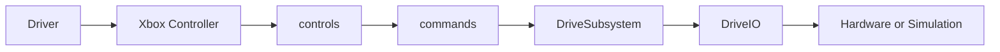
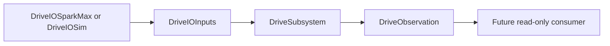
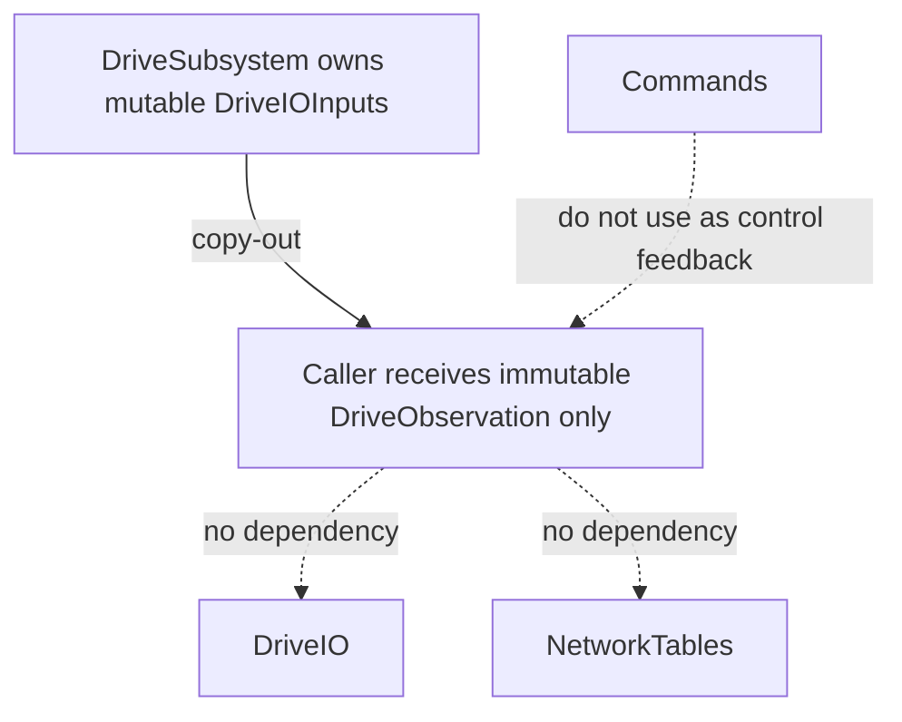

# D01_L01 Drive Observation Boundary

**Read-only observation architecture / Kiến trúc thông tin quan sát chỉ đọc**

- Module: D01
- Lesson: D01_L01_Drive_Observation_Boundary
- Source: D00_L06_Simulation_IO_Layer
- Status: IN_PROGRESS
- Documentation phase: Step 6

## 1. Cover / Title

**EN:** This guide documents the complete D01_L01 engineering transition.

**VI:** Tài liệu này mô tả đầy đủ quá trình kỹ thuật của D01_L01.

## 2. Lesson Identity

**EN:** Module D01, Lesson 01. Source: D00_L06_Simulation_IO_Layer. Status remains IN_PROGRESS until final freeze review.

**VI:** Module D01, Bài 01. Nguồn: D00_L06_Simulation_IO_Layer. Trạng thái vẫn là IN_PROGRESS cho đến vòng kiểm tra đóng băng cuối.

## 3. Document Map

**EN:** The guide moves from motivation and definitions through architecture, implementation, verification, and closure criteria.

**VI:** Tài liệu đi từ động cơ, định nghĩa đến kiến trúc, triển khai, xác minh và tiêu chí đóng lesson.

## 4. Prerequisites

**EN:** D00_L06 must be COMPLETE. Readers should understand DriveIO, DriveSubsystem, periodic execution, Java records, and dependency direction.

**VI:** D00_L06 phải COMPLETE. Người học cần hiểu DriveIO, DriveSubsystem, chu kỳ periodic, Java record và hướng phụ thuộc.

## 5. Learning Objectives

**EN:** Create a safe read-only observation boundary; preserve mutable IO ownership; understand immutable copy-out semantics; verify simulation behavior without publishing.

**VI:** Tạo ranh giới thông tin quan sát chỉ đọc an toàn; giữ quyền sở hữu dữ liệu IO mutable; hiểu copy-out bất biến; xác minh simulation mà không publishing.

## 6. Problem Before This Lesson

**EN:** DriveIOInputs already held applied outputs, but DriveSubsystem exposed no public observation API. Returning the mutable IO object would break encapsulation.

**VI:** DriveIOInputs đã chứa applied outputs nhưng DriveSubsystem chưa có API quan sát công khai. Trả trực tiếp object mutable sẽ phá vỡ encapsulation.

## 7. Why Observation Boundary Is Needed

**EN:** Future read-only consumers need stable values without learning hardware details or gaining a path to mutate drivetrain state.

**VI:** Consumer chỉ đọc trong tương lai cần giá trị ổn định mà không biết chi tiết phần cứng hoặc có đường sửa trạng thái drivetrain.

## 8. Scientific Definition of Observation

**EN:** Observation is a measurement view produced from completed system updates. It describes what was observed; it does not issue commands.

**VI:** Observation (Thông tin quan sát) là góc nhìn đo lường sinh ra từ một lần cập nhật hệ thống đã hoàn tất. Nó mô tả điều được quan sát, không phát lệnh.

## 9. Observation vs Internal State

**EN:** Internal state may be mutable and implementation-oriented. A public observation is a detached immutable value.

**VI:** Trạng thái nội bộ có thể mutable và phục vụ implementation. Thông tin quan sát công khai là giá trị bất biến đã tách rời.

## 10. Observation vs Telemetry

**EN:** Observation is a read model. Telemetry is a later delivery/publishing concern. This lesson implements no publisher.

**VI:** Observation là mô hình đọc. Telemetry là concern truyền/publish ở lesson sau. Lesson này không triển khai publisher.

## 11. Observation vs Command

**EN:** A command changes mechanism behavior. An observation only reports values from the latest completed periodic update.

**VI:** Command thay đổi hành vi cơ cấu. Observation chỉ báo cáo giá trị từ lần periodic hoàn tất gần nhất.

## 12. Frozen Backbone

**EN:** The driver control path remains unchanged. The new path is parallel and read-only.

**VI:** Luồng điều khiển từ người lái không đổi. Luồng mới chạy song song và chỉ đọc.



## 13. Architecture Before D01_L01

**EN:** DriveSubsystem owned mutable DriveIOInputs, but no caller could read a safe public representation.

**VI:** DriveSubsystem sở hữu DriveIOInputs mutable nhưng caller chưa thể đọc một biểu diễn công khai an toàn.

```text
DriveIO implementation -> DriveIOInputs -> DriveSubsystem
No public read-only observation API
```

## 14. Architecture After D01_L01

**EN:** The Observation Layer exposes a detached read-only value. DriveSubsystem copies the latest two input values into a new immutable DriveObservation record.

**VI:** Tầng thông tin quan sát cung cấp một giá trị chỉ đọc đã tách rời. DriveSubsystem sao chép hai input mới nhất vào record DriveObservation bất biến mới.



## 15. Dependency Direction

**EN:** DriveSubsystem depends on the passive observation value. DriveObservation has no robot-layer imports and no reverse dependency.

**VI:** DriveSubsystem phụ thuộc vào giá trị quan sát thụ động. DriveObservation không import robot layer và không có phụ thuộc ngược.

## 16. Mutable Internal Data

**EN:** DriveIOInputs stays private to DriveSubsystem and remains the mutable transfer object updated by DriveIO.

**VI:** DriveIOInputs vẫn private trong DriveSubsystem và là transfer object mutable do DriveIO cập nhật.

## 17. Immutable Public Observation

**EN:** DriveObservation is a public Java record with exactly two double components and no custom behavior.

**VI:** DriveObservation (Thông tin quan sát của hệ truyền động) là Thông tin quan sát chỉ đọc và là Ảnh chụp dữ liệu bất biến, có đúng hai component double và không có hành vi tùy chỉnh.

## 18. Ownership Model

**EN:** DriveSubsystem owns DriveIOInputs. Callers receive DriveObservation only. No caller receives the internal reference.

**VI:** DriveSubsystem sở hữu DriveIOInputs. Caller chỉ nhận DriveObservation. Không caller nào nhận reference nội bộ.



## 19. Periodic Update Timing

**EN:** DriveSubsystem.periodic() is the only production call site for io.updateInputs(inputs). getObservation() performs no update.

**VI:** DriveSubsystem.periodic() là call site production duy nhất của io.updateInputs(inputs). getObservation() không cập nhật IO.

## 20. Stale Data Semantics

**EN:** An observation reflects the latest completed periodic update. Before the first update, record values may be defaults.

**VI:** Observation phản ánh periodic update hoàn tất gần nhất. Trước lần cập nhật đầu, record có thể chứa giá trị mặc định.

## 21. Step-by-Step Transition from D00_L06

### Step 1 - Copy D00_L06 as D01_L01

**Objective:** Establish inheritance without reconstructing the project.

**Why:** This step is required to establish inheritance without reconstructing the project.

**Action:** Copy the complete source lesson directory.

**Expected Result:** A byte-identical independent WPILib project.

**Verification:** Compare file sets and Java hashes.

### Step 2 - Activate lesson metadata

**Objective:** Prevent inherited completion claims.

**Why:** This step is required to prevent inherited completion claims.

**Action:** Set D01 identity and IN_PROGRESS status only.

**Expected Result:** The new lesson is active but unfinished.

**Verification:** Inspect LESSON_STATUS.md.

### Step 3 - Baseline clean and build

**Objective:** Prove the inherited baseline before implementation.

**Why:** This step is required to prove the inherited baseline before implementation.

**Action:** Run Gradle clean and build.

**Expected Result:** BUILD SUCCESSFUL.

**Verification:** Record clean/build evidence.

### Step 4 - Review mutable DriveIOInputs ownership

**Objective:** Identify the state that must remain internal.

**Why:** This step is required to identify the state that must remain internal.

**Action:** Trace creation, ownership, and update calls.

**Expected Result:** DriveSubsystem remains the sole owner.

**Verification:** Confirm private final inputs field.

### Step 5 - Review observation design alternatives

**Objective:** Avoid accidental mutable exposure or premature abstraction.

**Why:** This step is required to avoid accidental mutable exposure or premature abstraction.

**Action:** Compare getters, immutable snapshot, copied inputs, and callbacks.

**Expected Result:** Immutable record selected.

**Verification:** Architecture review PASS.

### Step 6 - Lock observation namespace

**Objective:** Place the public model without coupling it to IO or telemetry.

**Why:** This step is required to place the public model without coupling it to IO or telemetry.

**Action:** Approve frc.robot.observation.drive.

**Expected Result:** Stable domain-specific namespace.

**Verification:** Package review PASS.

### Step 7 - Create DriveObservation.java

**Objective:** Represent observation as immutable data.

**Why:** This step is required to represent observation as immutable data.

**Action:** Create a public record with two double components.

**Expected Result:** Immutable observation type compiles.

**Verification:** Inspect declaration and imports.

### Step 8 - Add DriveSubsystem.getObservation()

**Objective:** Expose safe copy-out data.

**Why:** This step is required to expose safe copy-out data.

**Action:** Return a new record from current input values.

**Expected Result:** Caller receives no mutable reference.

**Verification:** Inspect method body.

### Step 9 - Perform static architecture checks

**Objective:** Protect Frozen Backbone and dependencies.

**Why:** This step is required to protect Frozen Backbone and dependencies.

**Action:** Search call sites, imports, publishing, and protected files.

**Expected Result:** No forbidden dependency appears.

**Verification:** Static audit PASS.

### Step 10 - Run clean production build

**Objective:** Verify compilation after implementation.

**Why:** This step is required to verify compilation after implementation.

**Action:** Run Gradle clean and build.

**Expected Result:** BUILD SUCCESSFUL.

**Verification:** Production Build PASS.

### Step 11 - Verify simulation data flow

**Objective:** Prove end-to-end data movement through DriveIOSim.

**Why:** This step is required to prove end-to-end data movement through DriveIOSim.

**Action:** Use a temporary external harness.

**Expected Result:** DriveIOSim values reach DriveObservation.

**Verification:** Harness completes all assertions.

### Step 12 - Verify initial observation

**Objective:** Confirm deterministic defaults.

**Why:** This step is required to confirm deterministic defaults.

**Action:** Run one periodic update before any output request.

**Expected Result:** Observation is 0.0, 0.0.

**Verification:** Exact comparison PASS.

### Step 13 - Verify positive asymmetric outputs

**Objective:** Prove independent positive values.

**Why:** This step is required to prove independent positive values.

**Action:** Request 0.25 and 0.60, then periodic.

**Expected Result:** Observation is 0.25, 0.60.

**Verification:** Exact comparison PASS.

### Step 14 - Verify negative asymmetric outputs

**Objective:** Prove independent negative values.

**Why:** This step is required to prove independent negative values.

**Action:** Request -0.40 and -0.75, then periodic.

**Expected Result:** Observation is -0.40, -0.75.

**Verification:** Exact comparison PASS.

### Step 15 - Verify mixed outputs

**Objective:** Prove signs remain independent.

**Why:** This step is required to prove signs remain independent.

**Action:** Request 0.50 and -0.30, then periodic.

**Expected Result:** Observation is 0.50, -0.30.

**Verification:** Exact comparison PASS.

### Step 16 - Verify stop behavior

**Objective:** Confirm stopped state is observable.

**Why:** This step is required to confirm stopped state is observable.

**Action:** Call stop and then periodic.

**Expected Result:** Observation returns 0.0, 0.0.

**Verification:** Exact comparison PASS.

### Step 17 - Verify snapshot immutability

**Objective:** Prove old observations never change.

**Why:** This step is required to prove old observations never change.

**Action:** Keep snapshot A, update state, then create snapshot B.

**Expected Result:** A retains old values; B has new values.

**Verification:** Reflection and numeric assertions PASS.

### Step 18 - Verify no immediate hardware read

**Objective:** Keep observation access side-effect-free.

**Why:** This step is required to keep observation access side-effect-free.

**Action:** Read repeatedly between periodic updates and count updateInputs calls.

**Expected Result:** Values and update count remain unchanged.

**Verification:** Count remains 4 to 4.

### Step 19 - Clean generated artifacts

**Objective:** Leave only maintainable lesson assets.

**Why:** This step is required to leave only maintainable lesson assets.

**Action:** Remove harness, tests, build, .gradle, classes, and logs.

**Expected Result:** No temporary artifact remains.

**Verification:** Filesystem and Git inspection PASS.

### Step 20 - Prepare documentation and freeze review

**Objective:** Create durable learning evidence before closure.

**Why:** This step is required to create durable learning evidence before closure.

**Action:** Generate Markdown, Word, PDF, README, and status evidence.

**Expected Result:** Lesson remains IN_PROGRESS and ready for freeze review.

**Verification:** Visual and technical documentation QA PASS.

## 22. Files Created

**EN:** `DriveObservation.java` plus this Markdown, Word, and PDF guide and the lesson README.

**VI:** `DriveObservation.java` cùng bộ hướng dẫn Markdown, Word, PDF và README của lesson.

## 23. Files Modified

**EN:** `DriveSubsystem.java` and LESSON_STATUS.md. README is new because the inherited lesson had no lesson-level README.

**VI:** `DriveSubsystem.java` và LESSON_STATUS.md. README là file mới vì lesson nguồn không có README cấp lesson.

## 24. Complete Source Code

**EN:** The following listings are copied directly from production source at documentation time.

**VI:** Các listing sau được đọc trực tiếp từ production source tại thời điểm tạo tài liệu.

### DriveObservation.java

```java
// Copyright (c) FIRST and other WPILib contributors.
// Open Source Software; you can modify and/or share it under the terms of
// the WPILib BSD license file in the root directory of this project.

/**
 * Author: SSIS
 * Mentor: SSIS
 */

package frc.robot.observation.drive;

/**
 * Provides an immutable drivetrain observation from the latest completed subsystem periodic
 * update.
 *
 * @param leftAppliedOutput normalized, dimensionless left-side applied output
 * @param rightAppliedOutput normalized, dimensionless right-side applied output
 */
public record DriveObservation(
    double leftAppliedOutput,
    double rightAppliedOutput) {}
```

### DriveSubsystem.java

```java
// Copyright (c) FIRST and other WPILib contributors.
// Open Source Software; you can modify and/or share it under the terms of
// the WPILib BSD license file in the root directory of this project.

/**
 * Author: SSIS
 * Mentor: SSIS
 */

package frc.robot.subsystems;

import edu.wpi.first.math.MathUtil;
import edu.wpi.first.wpilibj2.command.SubsystemBase;
import frc.robot.Constants.DriveConstants;
import frc.robot.io.drive.DriveIO;
import frc.robot.io.drive.DriveIO.DriveIOInputs;
import frc.robot.observation.drive.DriveObservation;

/**
 * Provides high-level drivetrain behavior.
 */
public class DriveSubsystem extends SubsystemBase {
  private final DriveIO io;
  private final DriveIOInputs inputs = new DriveIOInputs();

  /**
   * Creates the drive subsystem.
   *
   * @param io real or simulated drivetrain hardware
   */
  public DriveSubsystem(DriveIO io) {
    this.io = io;
    stop();
  }

  @Override
  public void periodic() {
    io.updateInputs(inputs);
  }

  /**
   * Returns an immutable observation from the latest completed periodic update.
   *
   * <p>Before the first periodic update, the observation may contain default values.
   *
   * @return latest drivetrain observation
   */
  public DriveObservation getObservation() {
    return new DriveObservation(
        inputs.leftAppliedOutput,
        inputs.rightAppliedOutput);
  }

  /**
   * Drives the left and right sides independently.
   *
   * @param leftOutput left-side output
   * @param rightOutput right-side output
   */
  public void tankDrive(
      double leftOutput,
      double rightOutput) {
    double safeLeftOutput =
        MathUtil.clamp(
            leftOutput,
            DriveConstants.kMinimumDriveOutput,
            DriveConstants.kMaximumDriveOutput);

    double safeRightOutput =
        MathUtil.clamp(
            rightOutput,
            DriveConstants.kMinimumDriveOutput,
            DriveConstants.kMaximumDriveOutput);

    io.setTankOutputs(
        safeLeftOutput,
        safeRightOutput);
  }

  /**
   * Stops the complete drivetrain.
   */
  public void stop() {
    io.stop();
  }
}
```

## 25. Build Verification

**EN:** Baseline and production clean builds completed successfully with the WPILib 2026 Java 17 toolchain.

**VI:** Baseline và production clean build đều thành công với WPILib 2026 Java 17.

## 26. Simulation Verification

**EN:** A temporary external harness exercised DriveSubsystem with DriveIOSim and was deleted after verification.

**VI:** Harness tạm bên ngoài production đã kiểm tra DriveSubsystem với DriveIOSim và được xóa sau xác minh.

## 27. Test Cases and Results

**EN:** All required numeric cases used exact double comparison because DriveIOSim stores and copies values directly.

**VI:** Tất cả case số dùng so sánh double chính xác vì DriveIOSim chỉ lưu và sao chép trực tiếp.

| Case | Expected | Actual | Result |
| --- | --- | --- | --- |
| A - Initial | (0.0, 0.0) | (0.0, 0.0) | PASS |
| B - Positive | (0.25, 0.60) | (0.25, 0.60) | PASS |
| C - Negative | (-0.40, -0.75) | (-0.40, -0.75) | PASS |
| D - Mixed | (0.50, -0.30) | (0.50, -0.30) | PASS |
| E - Stop | (0.0, 0.0) | (0.0, 0.0) | PASS |
| F - Immutable | A unchanged; B updated | A unchanged; B updated | PASS |
| G - No read | update count 4 -> 4 | update count 4 -> 4 | PASS |

## 28. Snapshot Immutability Explanation

**EN:** Java record components are private and final. Snapshot A remains unchanged after later updates create snapshot B.

**VI:** Component của Java record là private và final. Snapshot A không đổi khi cập nhật sau tạo snapshot B.

## 29. Side-effect-Free Access Explanation

**EN:** getObservation() only constructs a value; it never calls updateInputs, hardware APIs, or output methods.

**VI:** getObservation() chỉ tạo value; không gọi updateInputs, hardware API hoặc output method.

## 30. Alternatives Considered

**EN:** Primitive getters, copied DriveIOInputs, callbacks, telemetry packages, and generic frameworks were reviewed.

**VI:** Primitive getters, DriveIOInputs copy, callback, telemetry package và generic framework đã được đánh giá.

## 31. Why Primitive Getters Were Rejected

**EN:** Two getters work today but weaken snapshot cohesion and encourage getter proliferation.

**VI:** Hai getter có thể hoạt động nhưng làm yếu tính gắn kết của snapshot và khuyến khích tăng số getter.

## 32. Why DriveIOInputs Exposure Was Rejected

**EN:** DriveIOInputs is mutable and belongs to the IO transfer boundary, not the public subsystem API.

**VI:** DriveIOInputs mutable và thuộc ranh giới truyền dữ liệu IO, không thuộc public subsystem API.

## 33. Why Callback/Consumer Was Rejected for This Lesson

**EN:** No asynchronous producer or subscriber lifecycle exists; callback registration would add unused complexity.

**VI:** Không có producer bất đồng bộ hay subscriber lifecycle; callback registration sẽ tăng complexity không cần thiết.

## 34. Why NetworkTables Was Not Added

**EN:** Publishing is a separate future concept. Observation must exist independently of transport.

**VI:** Publishing là concept riêng của tương lai. Observation phải tồn tại độc lập với transport.

## 35. Package Decision

**EN:** `frc.robot.observation.drive` follows the repository pattern technical-layer.domain and keeps the value independent.

**VI:** `frc.robot.observation.drive` theo pattern technical-layer.domain và giữ value độc lập.

## 36. Scope Exclusions

**EN:** No publishing, sensors, pose, physics, simulation-state extraction, commands, controls, hardware configuration, or IO redesign.

**VI:** Không publishing, sensor, pose, physics, tách simulation state, command, control, cấu hình hardware hoặc redesign IO.

## 37. Architecture Checklist

**EN:** Frozen control path preserved; mutable inputs private; immutable output public; one-way dependencies; no publishing.

**VI:** Giữ Frozen control path; input mutable private; output bất biến public; dependency một chiều; không publishing.

## 38. Verification Checklist

**EN:** Build PASS; simulation cases PASS; immutability PASS; side-effect access PASS; artifacts removed.

**VI:** Build PASS; simulation cases PASS; immutability PASS; truy cập không side effect PASS; artifact đã xóa.

## 39. Common Mistakes

**EN:** Do not return DriveIOInputs, call updateInputs from the getter, publish from the subsystem, or use observation for command feedback.

**VI:** Không trả DriveIOInputs, gọi updateInputs trong getter, publish từ subsystem hoặc dùng observation làm command feedback.

## 40. FAQ

**EN:** Is this telemetry? No. Is it real-time hardware read? No. Can callers mutate it? No. Is real robot verified? No.

**VI:** Đây có phải telemetry không? Không. Có đọc hardware tức thời không? Không. Caller có sửa được không? Không. Đã test robot thật chưa? Chưa.

## 41. Homework or Reflection Questions

**EN:** Explain why copy-out is safer than reference exposure. Describe when primitive getters could be acceptable. Identify the future publishing boundary.

**VI:** Giải thích vì sao copy-out an toàn hơn expose reference. Khi nào primitive getter có thể phù hợp? Xác định ranh giới publishing tương lai.

## 42. Lab Report Summary

**EN:** D01_L01 introduced one concept: a read-only immutable drive observation boundary above DriveIO.

**VI:** D01_L01 giới thiệu đúng một concept: ranh giới thông tin quan sát bất biến, chỉ đọc phía trên DriveIO.

## 43. Lesson Completion Criteria

**EN:** Documentation PASS is not lesson completion. Final freeze review, commit, push, and clean repository verification remain required.

**VI:** Documentation PASS chưa phải lesson complete. Vẫn cần freeze review, commit, push và xác minh repository sạch.

## 44. Next-Lesson Boundary

**EN:** A future lesson may consume DriveObservation for read-only publishing, but D01_L01 contains no NetworkTables or telemetry publisher.

**VI:** Lesson tương lai có thể dùng DriveObservation để publish chỉ đọc, nhưng D01_L01 không có NetworkTables hoặc telemetry publisher.

